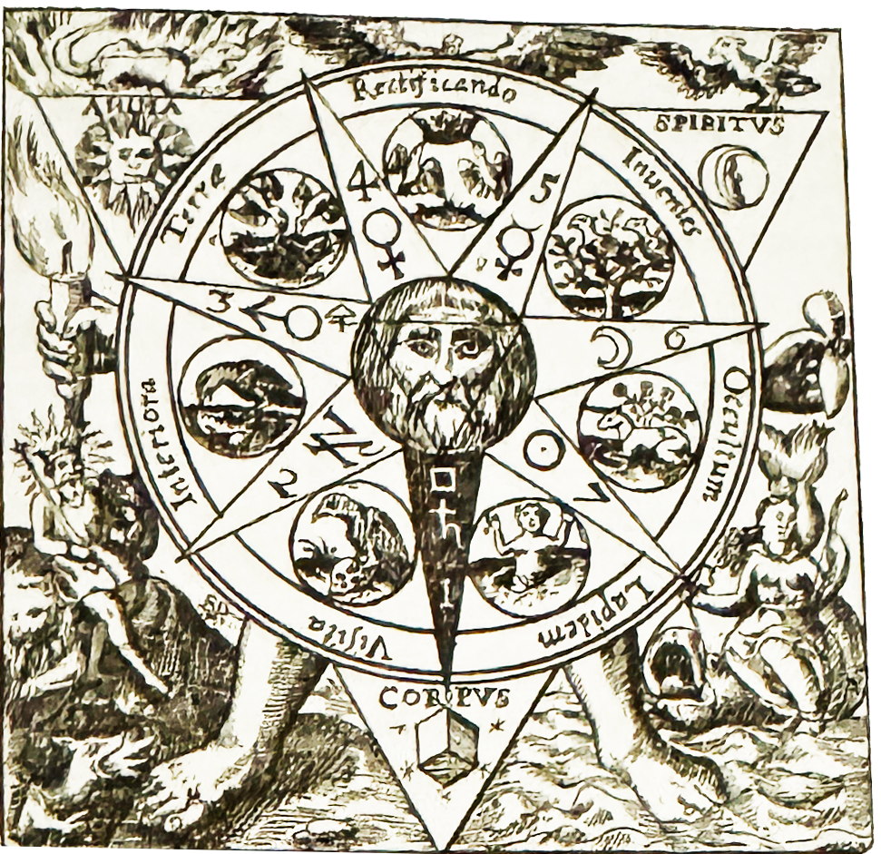

---
layout:
  title:
    visible: true
  description:
    visible: true
  tableOfContents:
    visible: true
  outline:
    visible: false
  pagination:
    visible: true
---

# Alchemy, by Dennis William Hauck

<figure><figcaption></figcaption></figure>

### <mark style="color:purple;">The word alchemy comes from the Arabic phrase al-khemia, which means "from the land of Khem". Khem is the Egyptian hieroglyph for "black", which specifically refers to the rich, black soil found in the Nile River delta. This, alchemy became known as the "Black Art", which also evokes the dark, secretive practices of the alchemists.</mark>

### <mark style="color:purple;">Scholars consider the era of Egyptian alchemy to span the centuries from 5000 BCE to 350 BCE. That was followed by a period of Greek alchemy in Egypt from the arrival of Alexander The Great (332 BCE) to the Arabian invasion (642 BCE), when godlike beings roamed the earth. The Egyptians considered Thoth the primordial source of all thought - the inventor of writing, philosophy, theology, law, literature, magic, alchemy, mathematics, and all the sciences.</mark>

### <mark style="color:purple;">Thoth represents the archetypal concept of mind, the wellspring for all human insight and inspiration. An Egyptian motto says, "May Thoth speak to you daily". According to the Ebers Papyrus (1550 BCE), a  68-foot-long scroll on medical alchemy that is the oldest book in the world, "Man's guide is Thoth, who bestows on him the gifts of his speech, who makes the books, and illumines those who are learned therein, and the physicians who follow him, that they may work their cures".</mark>

<figure><figcaption>
The Emerald Tablet.
</figcaption></figure>

### <mark style="color:purple;">The Greek god Hermes and Egyptian god Thoth were worshiped as a single entity in the Hellenistic city of Hermopolis, and the Hermetic writings were associated with an ancient Egyptian priest known as Hermes Trismegistus. The teachings attributed to him inspired an explosion of interpretive texts in philosophy, religion, alchemy, and magick that were housed in the Great Library of Alexandria (305 BCE).</mark>

### <mark style="color:purple;">Eventually, the library grew over 400,000 scrolls and became a center of learning that attracted scholars from all over the world. In that fertile environment, alchemy evolved from a disorganized collection of smelting procedures and tincturing recipes into a Hermetic science focused on understanding the universal principles of transformation. From Alexandria, the teachings spread to the Arabian lands, Mesopotamia, India, and China.</mark>



### <mark style="color:purple;">In a tragic loss to humankind, the Great Library of Alexandria caught fire during a power struggle between Ptolemy XIII and his sister Cleopatra in 48 BCE. The library was engulfed in a firestorm that ignited from soldiers fighting on the city's docks. The surviving scrolls were moved to two nearby temples that served as a library for another three centuries.</mark>

### <mark style="color:purple;">Then, in 290 CE, Roman Emperor Diocletian decreed the destruction of all alchemy manuscripts in Egypt, which resulted in a significant loss of precious texts. In 391 CE, Christian zealots attacked one of the temples, destroyed all the scrolls, and turned the building into a Christian church. Finally, in 415 CE, Christian mobs destroyed the remaining temple library. They dragged Hypatia, the last librarian, into the street and accused her of teaching Greek philosophy. Using abalone shells, they scraped the flesh from her body while she was still alive.</mark>

### <mark style="color:purple;">The extinguishing of the light of Alexandria and the suppression of Greek philosophy were the results of the dogmatic control of knowledge and fear of new ideas gripping the world. Known as the Dark Ages, it was a period of stagnant intellectual growth and lack of innovation that lasted from the fall of the Roman Empire ( 476 CE) to the beginning of the second millennium (1000 CE).</mark>

### <mark style="color:purple;">Fortunately, alchemy and the Hermetic teaching survived in the Arabian lands and were rekindled in Europe with the infusion of copied Alexandrian manuscripts brought to Spain by Arabian invaders. The Arabs crossed over from Morocco in 711 CE and occupied Spain for more than seven centuries. The Islamic rulers proved very tolerant, and Spain soon became a haven for philosophers, alchemists, magickians, and freethinkers of all persuasions. By 1100, Latin translations of alchemy and Hermetic manuscripts were spreading throughout Europe. Alchemy would thrive in Europe for the next seven hundred years.</mark>



