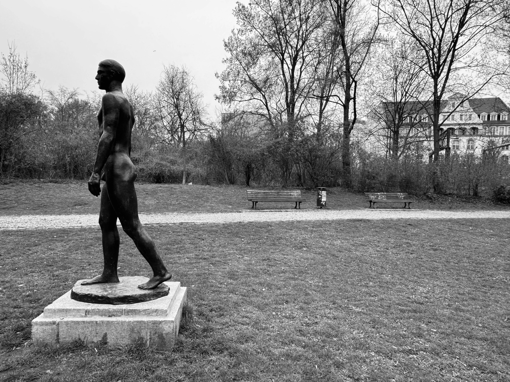

---
layout:
  title:
    visible: true
  description:
    visible: true
  tableOfContents:
    visible: true
  outline:
    visible: false
  pagination:
    visible: true
---

# Stand Sill Like the Hummingbird

<figure><figcaption></figcaption></figure>

### <mark style="color:green;">"</mark>_<mark style="color:green;">**When you can go neither backward or forward, when you discover you are no longer able to stand,  sit, or lie down, when your children have died of malnutrition, and your aged parents have been sent to the poorhouse or the gas chamber, when you realize you can neither write nor not write, when you are convinced all the exits are blocked, either you take to believing in miracles or you stand still like the hummingbird.**</mark>_&#x20;

### _<mark style="color:green;">**The miracle is that the honey is always there, right under your nose, only you were too busy searching elsewhere to realize it. The worst is not death but being blind, blind to the fact that everything about life is in the nature of the miraculous."**</mark>_

### <mark style="color:purple;">**- Henry Miller, from "Stand Sill Like the Hummingbird"**</mark>
