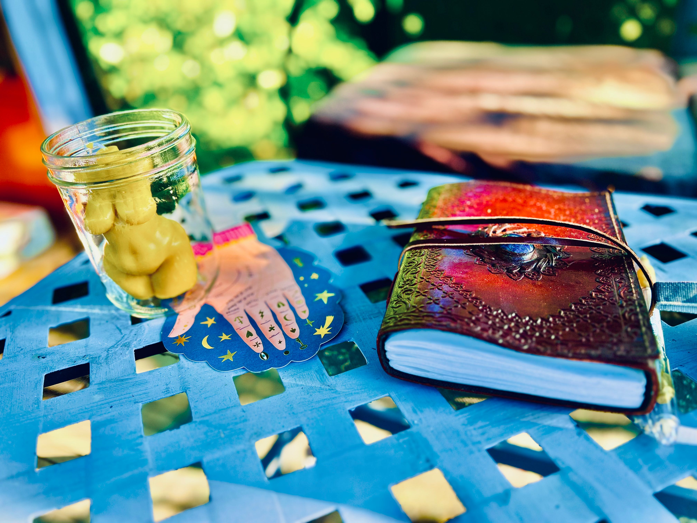

# 🏆 You won this adventure!

<figure><figcaption></figcaption></figure>

### _<mark style="color:purple;">"We are just an advanced breed of monkeys</mark>_&#x20;

### _<mark style="color:purple;">on a minor planet of a very average star.</mark>_&#x20;

### _<mark style="color:purple;">But we can understand the Universe.</mark>_&#x20;

### _<mark style="color:purple;">That makes us something very special."</mark>_&#x20;

### <mark style="color:green;">― Stephen Hawking</mark>

### _<mark style="color:purple;">"The way of mastery is to break all the rules —</mark>_&#x20;

### _<mark style="color:purple;">but you have to know them perfectly before you can do this;</mark>_&#x20;

### _<mark style="color:purple;">otherwise you are not in a position to transcend them."</mark>_

### <mark style="color:green;">― Aleister Crowley</mark>


