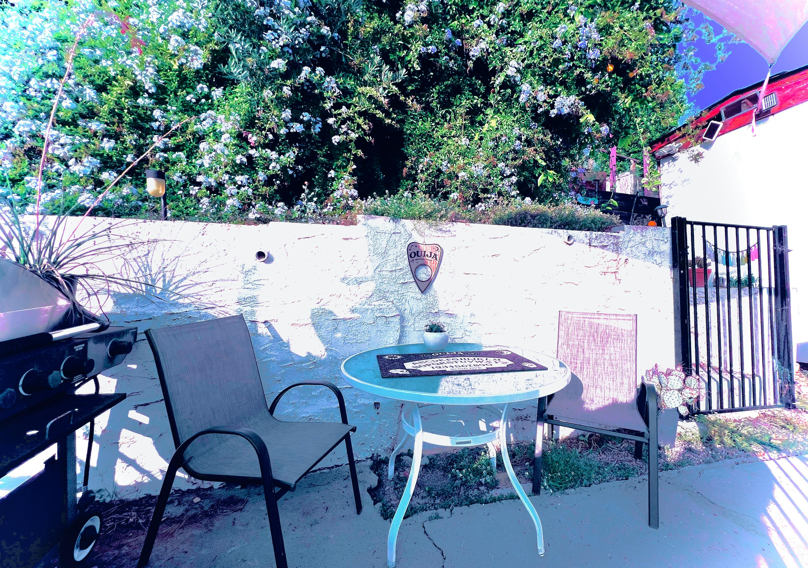

# 𝚯 Theta brainwaves (4-7 hertz)

<figure><figcaption></figcaption></figure>

### <mark style="color:purple;">Theta brainwave activity is a very relaxed state, representing the twilight zone between waking and sleep. These waves are present when players are</mark> <mark style="color:orange;">dreaming</mark> <mark style="color:purple;">and at higher states of</mark> <mark style="color:orange;">creativity</mark><mark style="color:purple;">.</mark>&#x20;

### <mark style="color:green;">Theta brainwaves are a gateway to</mark> <mark style="color:orange;">learning, memory, and intuition</mark><mark style="color:green;">. They produce a spacey state of mind associated with mental inefficiency and psychic experiences: in this state, direct logic is suppressed, and communication is conveyed through</mark> <mark style="color:orange;">symbols or abstract messages</mark><mark style="color:green;">.</mark>
