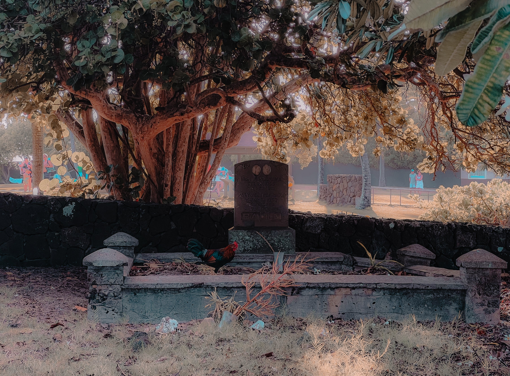

# 💐 𝙰𝚋𝚋𝚘𝚗𝚍𝚊𝚗𝚣𝚊 (abundance)

<figure><figcaption></figcaption></figure>

### <mark style="color:blue;">The player has attained abundance and enlightenment when:</mark>

* <mark style="color:blue;">**no external magickal practices are needed,**</mark>&#x20;
* <mark style="color:blue;">**astrological influences are no longer relevant (no karma due), and**</mark>
* <mark style="color:blue;">**they live The Way uninterruptedly.**</mark>

### _<mark style="color:purple;">"Before enlightenment, chop wood, carry water. After enlightenment, chop wood, carry water."</mark>_
