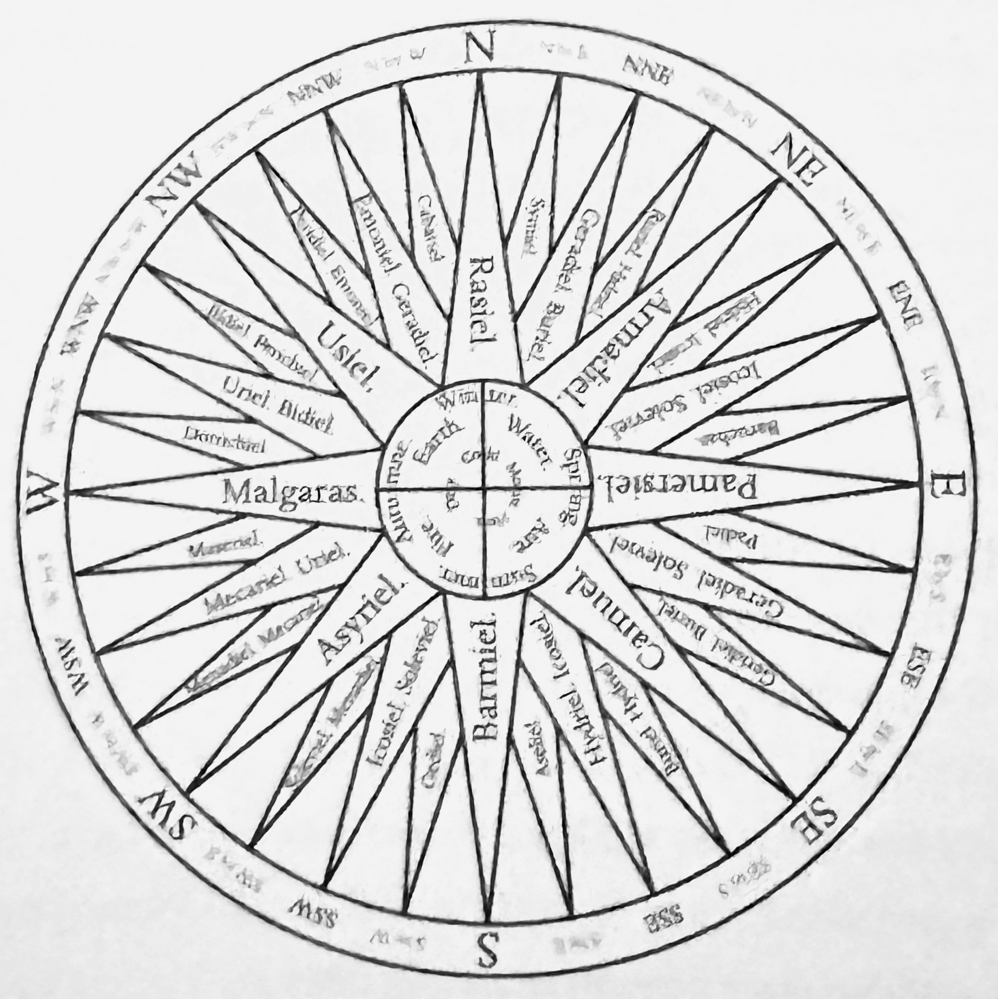

# Theurgia-Goetia

### <mark style="color:purple;">This grimoire is effectively a ritual version of the first book of Trithemiu's,</mark> <mark style="color:purple;"></mark>_<mark style="color:purple;">Steganographia</mark>_<mark style="color:purple;">, which was compiled by 1500. This book was claimed to be of cryptography or magick.</mark>

<figure><figcaption>
The Compass Rose, showing the directions from each spirit to be arriving.
</figcaption></figure>
