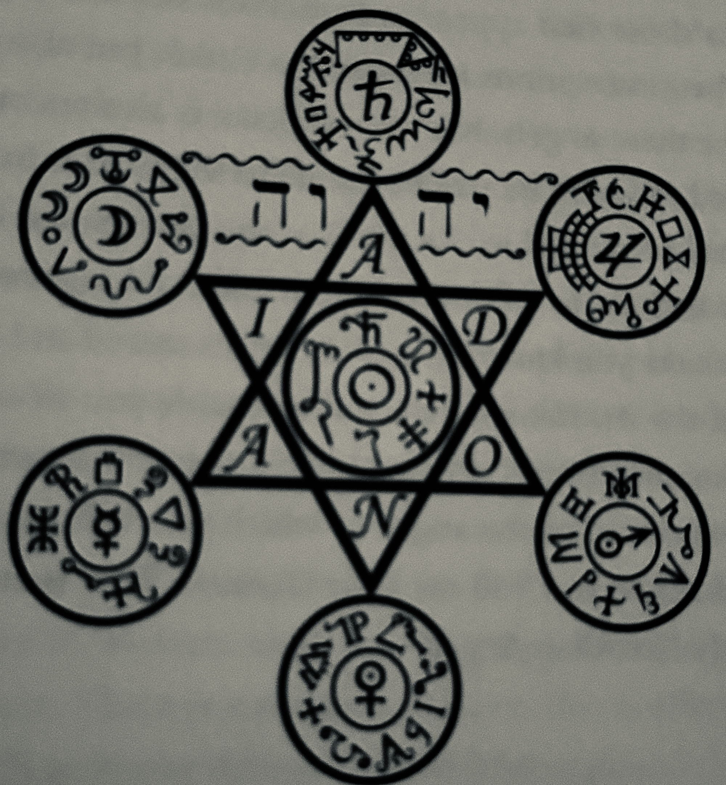

# Ars Paulina (parts I and II)

### <mark style="color:purple;">Focused on time and planetary rulerships, associating an angel to each of the twelve hours of the day and the night.</mark>

### <mark style="color:purple;">The second part helps to determine the angel ruling on each birth.</mark>

<figure><figcaption>
Table of Practice.
</figcaption></figure>
