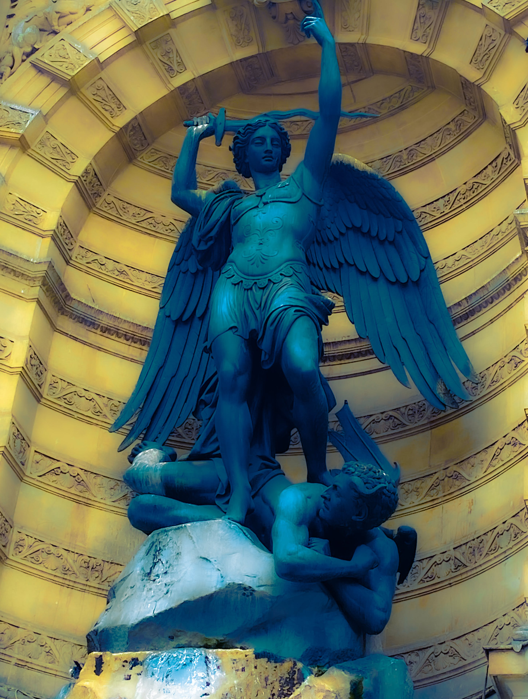

# The Goetia

<figure><figcaption></figcaption></figure>

## <mark style="color:blue;">Goetia is the arts of summoning and exercising control over demonic entities, based on their "Offices". Each of the demons has its sigil, and an angel who operates with them.</mark>



## <mark style="color:purple;">The goetia is a component of the grimoire known as "The Lesser Key of  Salomon" (Lemegeton).</mark>



> ☝🏽 _**"Goetia" finds its roots in the ancient Greek term "goēs," signifying "magician.**_&#x20;
>
> _**Two references to the 72 demons from Ars Goetia:**_ [_**here**_](https://darktemples.com/72-demons-solomons-ars-goetia/) _**and**_ [_**here**_](https://en.wikipedia.org/wiki/List_of_demons_in_the_Ars_Goetia)_**.**_


