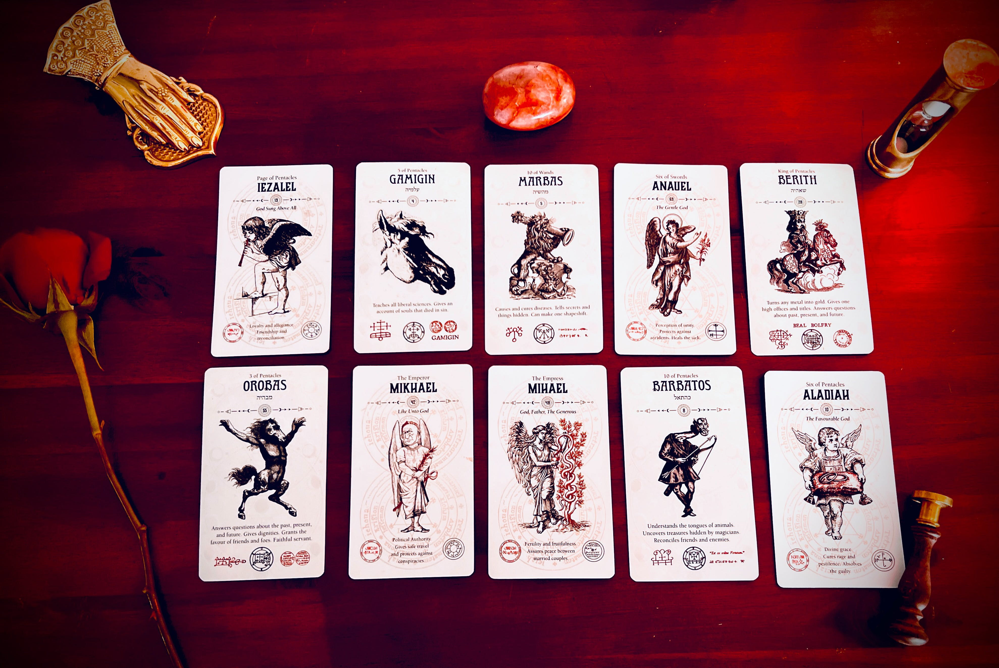

# ☝️ The One Only Rule

<figure><figcaption></figcaption></figure>

### <mark style="color:yellow;">Players</mark> <mark style="background-color:blue;">should not</mark> <mark style="background-color:blue;"></mark><mark style="background-color:blue;">**mess**</mark>**&#x20;**<mark style="color:yellow;">**with**</mark>&#x20;

### <mark style="background-color:blue;">other players</mark><mark style="color:yellow;">**' free will, desires, or choices.**</mark>

### &#x20;

### <mark style="background-color:blue;">**Everything else**</mark> <mark style="background-color:blue;"></mark><mark style="background-color:blue;">is valid.</mark>
