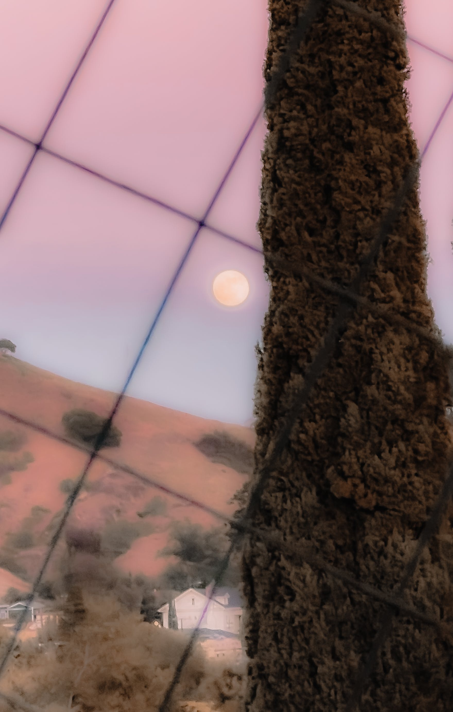

# What's shielding

<figure><figcaption></figcaption></figure>

### <mark style="color:purple;">Everything in this reality</mark>&#x20;

### <mark style="color:purple;">can be conceptualized as</mark>&#x20;

### <mark style="color:purple;">a form of</mark> [Energy](../energy/energy-in-alchemy.md)<mark style="color:purple;">.</mark>

### <mark style="color:green;">As the player starts tuning to higher wavelengths and</mark>&#x20;

### <mark style="color:green;">as the player's abilities become more tuned,</mark>&#x20;

### <mark style="color:green;">to be able to</mark> [keep progressing](../undefined-3/)<mark style="color:green;">,</mark>&#x20;

### <mark style="color:green;">they will need to set measures to wall up lower vibrations.</mark>

