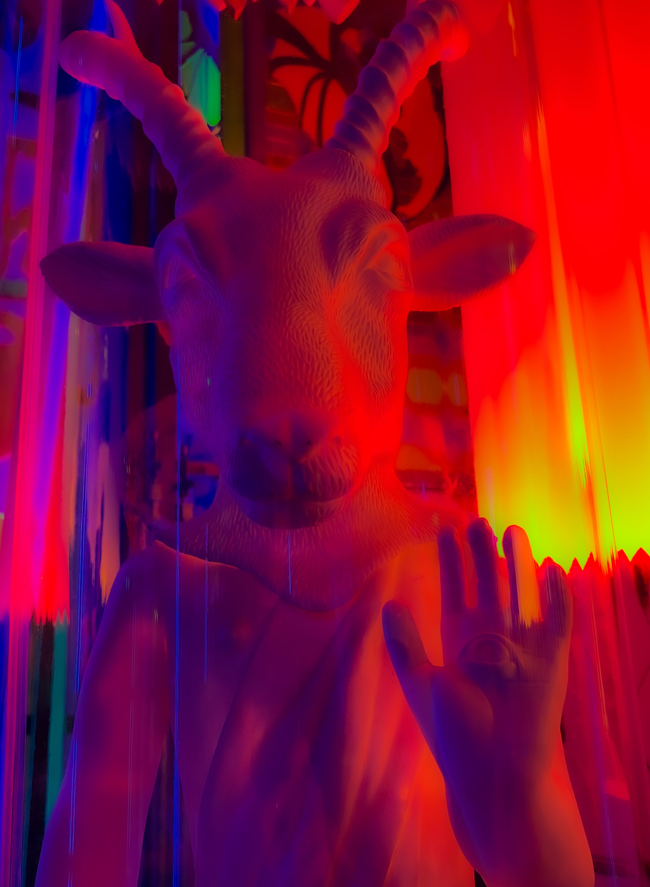

---
layout:
  title:
    visible: true
  description:
    visible: true
  tableOfContents:
    visible: false
  outline:
    visible: false
  pagination:
    visible: true
---

# Thelema

<figure><figcaption></figcaption></figure>

Below Tiphereth, the system can be arranged into five training tracks to bring the neophyte to Knowledge and Conversation of the HGA and beyond:

1. The development of magical skills and techniques.
2. The training of the mind.
3. The stimulation and activation of the chakras and the raising of kudalini.
4. Devotional practices (bhakti yoga).
5. Balancing the psycho-magical constitution.

At each grade, the aspirant builds a symbolic weapon to symbolize and concretize the inner changes occurring in that grade. These elemental weapons correspond to the four elements of earth, water, fire, and air, but they can also be understood in the context of Carl Jung's four functions of the psyche: sensation, intuition, thinking, and feeling:

1. the pentacle is the weapon of earth, Malkuth, and sensation.
2. The dagger is the weapon of air, Yesod, and intuition.
3. The cup is the weapon of water, Hod, and thinking.
4. The wand is the weapon of fire, Netzach, and desire.
