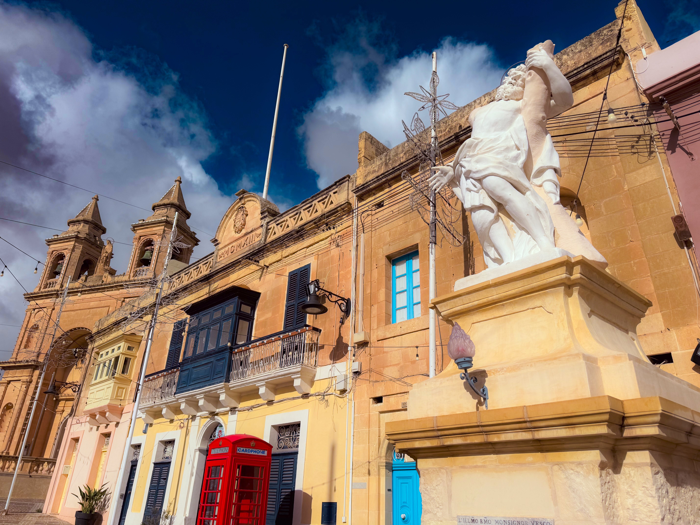

# The ultimate hero's journey

<figure><figcaption></figcaption></figure>

### _<mark style="color:purple;">**"**</mark><mark style="color:purple;">Adaptation to one's environment makes for a sort of survival;</mark>_&#x20;

### _<mark style="color:purple;">but after all, the</mark> <mark style="color:orange;">supreme victory</mark> <mark style="color:purple;">is only won by those who prove themselves of</mark> <mark style="color:orange;">so much hardier stuff than the rest,</mark>_&#x20;

### _<mark style="color:purple;">that</mark> <mark style="color:orange;">no power on earth is able to destroy them</mark><mark style="color:purple;">.</mark><mark style="color:purple;">**"**</mark>_

### <mark style="color:green;">― Aleister Crowley</mark>
