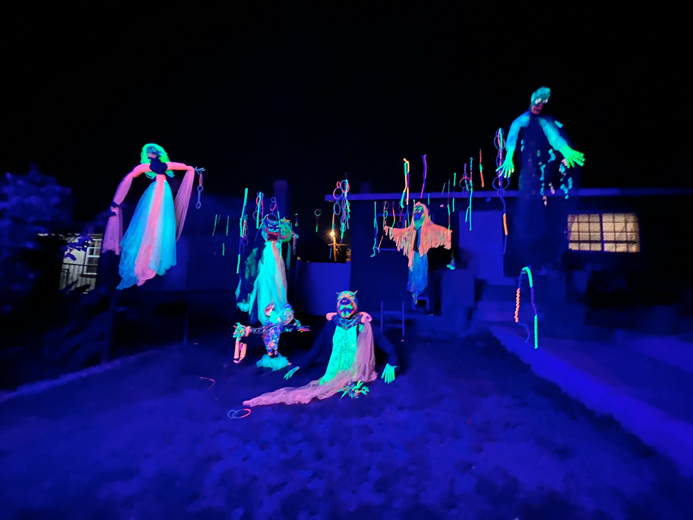

# 🜁 Aria

<figure><figcaption></figcaption></figure>

### <mark style="color:green;">Air represents the</mark> <mark style="color:orange;">player's circumstances</mark>&#x20;

### <mark style="color:green;">and</mark> <mark style="color:orange;">analytical abilities to make choices,</mark>&#x20;

### <mark style="color:green;">and the</mark> <mark style="color:orange;">consequences</mark> <mark style="color:green;">and</mark>&#x20;

### <mark style="color:green;">repercussions of these choices</mark>
