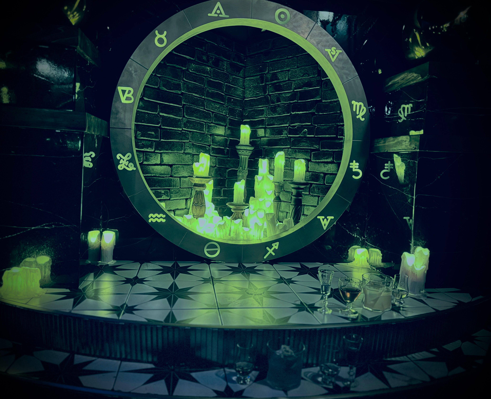

# 🜂 Fuoco

<figure><figcaption></figcaption></figure>

### <mark style="color:green;">Fire represents the</mark> <mark style="color:orange;">driving energy</mark>&#x20;

### <mark style="color:green;">of the</mark> <mark style="color:orange;">player's ego</mark> <mark style="color:green;">and desires</mark>

### <mark style="color:green;">It's the primordial force helping with</mark>&#x20;

### <mark style="color:green;">the</mark> <mark style="color:orange;">player's external goal</mark>
