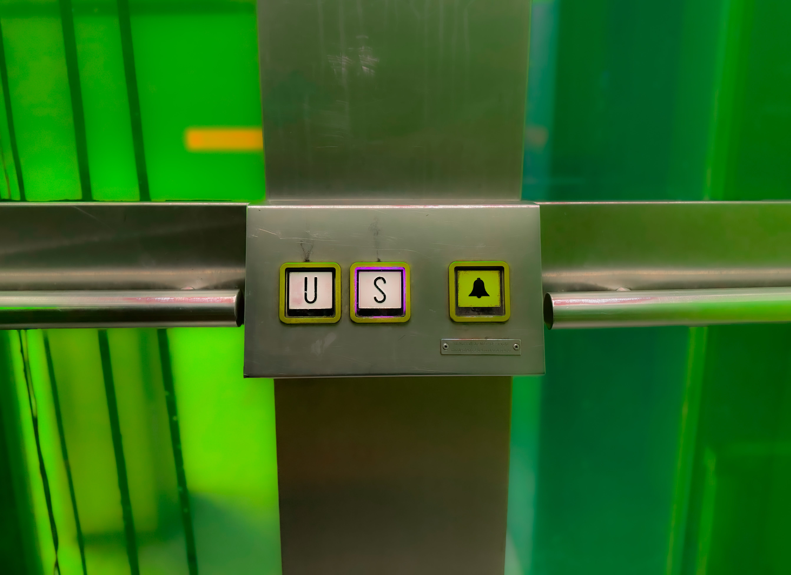

---
layout:
  title:
    visible: true
  description:
    visible: true
  tableOfContents:
    visible: false
  outline:
    visible: false
  pagination:
    visible: true
---

# What are Trines

<figure><figcaption></figcaption></figure>

### <mark style="color:purple;">A THC can be divided into three slices of 120°, which are called</mark> <mark style="color:purple;"></mark>_<mark style="color:purple;">trines</mark>_ <mark style="color:purple;"></mark><mark style="color:purple;">in the game of $CHOICES.</mark>

### <mark style="color:green;">Trine aspect occurs when two planets are in</mark> [synchronicity](../../../../../alchemy/the-usdchoice-of-alchemy/a/whats-syncronicity.md) <mark style="color:green;">with one another (and they share the</mark> same element<mark style="color:green;">).</mark>

### <mark style="color:purple;">Trining planets are working toward the same agenda, resulting in fortunate clouts for the player.</mark>

