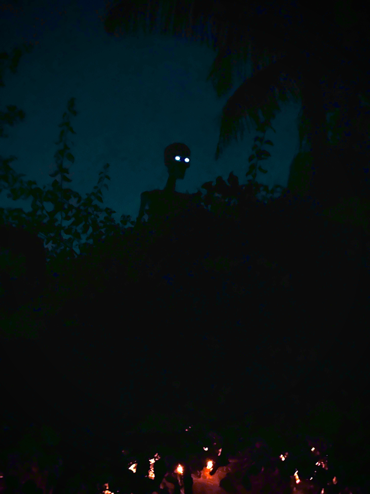

# What are Aspects

<figure><figcaption></figcaption></figure>

### <mark style="color:purple;">Aspects are certain</mark> [angles](../angles/) <mark style="color:purple;">of</mark> [planets](../planets/) <mark style="color:purple;">(objects) in a</mark> [THC](../the-hubble-chart-thc/the-hubble-chart-thc/#the-hubble-chart-is-a-two-dimensional-representation-of-the-sky-projected-to-earth-and-it-represents)<mark style="color:purple;">, as the underlying game of $CHOICE algorithm runs.</mark>

<figure><figcaption></figcaption></figure>

***

## <mark style="color:blue;">1. Between two objects in a player's Natal THC (TNHC):</mark>

### <mark style="color:green;">In a</mark> [natal THC](../the-hubble-chart-thc/birth-chart/)<mark style="color:green;">, angles between objects determine how the player is designed,</mark> <mark style="color:green;"></mark>_<mark style="color:green;">i.e.</mark>_<mark style="color:green;">, their avatar's attributes (strengths and weaknesses) in the game.</mark>



***

## <mark style="color:blue;">2. Between an object in a Transit THC (TTHC) and an object in the player's Natal THC (TNHC):</mark>

### <mark style="color:green;">When projecting a transit THC to the player's Natal THC, aspects of the transiting objects to the natal objects may provoke temporary clouts that may affect the player's</mark> [free will.](../../../reality/the-usdchoice-of-reality/is-free-will-real/)

###

<figure><figcaption></figcaption></figure>
