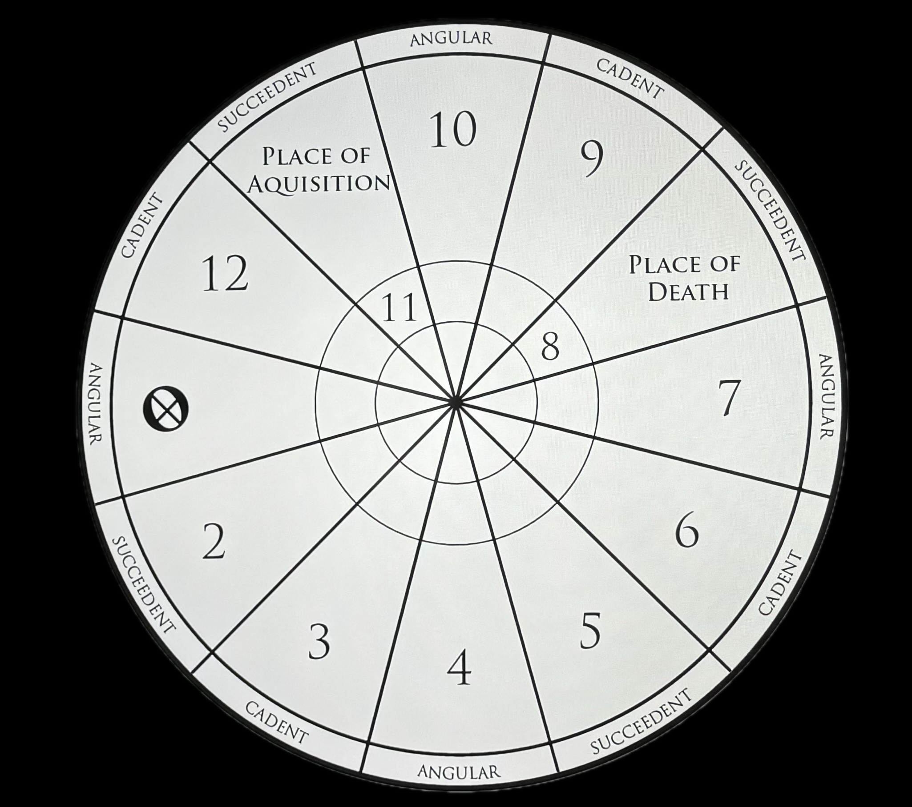

# Lot of Fortune

<figure><figcaption></figcaption></figure>

## <mark style="color:purple;">The lot of fortune is regarded to be the most important of all the seven hermetic lots.</mark>

## <mark style="color:purple;">As we saw in the previous page, it's a lunar lot calculated by taking the distance from the Moon to the Sun, projected forward from the ascendant, representing where a player finds their greatest joy and happiness in reality.</mark>&#x20;

## <mark style="color:purple;">Vettius Valens (Hellenistic astrologer from the 2nd century) describes it as “the most influential and most potent place” in the chart. Many ancient astrologers consider it to be of equal importance to the “big three”.</mark>



