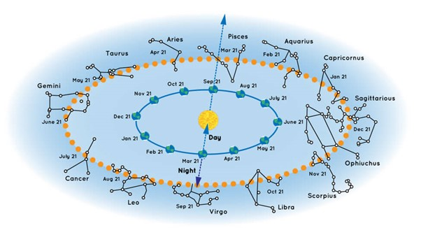

# 🌌 𝚃𝚑𝚎 𝟷𝟸 𝙲𝚘𝚗𝚜𝚝𝚎𝚕𝚕𝚊𝚝𝚒𝚘𝚗𝚜

<figure><figcaption></figcaption></figure>

### <mark style="color:purple;">On Earth, we see the 12 astronomical constellations "passing through" when we look at the Milky Way. Each of the 12 constellations was historically named after one of the</mark> [zodiac signs](./)<mark style="color:purple;">.</mark>&#x20;

<figure><figcaption></figcaption></figure>

**In** [**Astronomy**](../../../astrophysics/)**, an exact science, calculations are always done considering no privileged (absolute) framework in the entire Universe (per** [**Einstein's Theory of Relativity**](https://en.wikipedia.org/wiki/Theory_of_relativity)**).**&#x20;

**In** [**Astrology**](../../)**, a (still) non-exact science, calculations are always done by looking at the projection of how the Solar System and the main constellations interplay with us on Earth. From our viewpoint, the Sun (and other "**[**planets**](../planets/)**") appears to travel around us, crossing each of the 12 constellations in their way.**


**☝️ Did you know?**&#x20;

**In astronomy, the Sun and the Moon are obviously not planets (instead, a star and a satellite).** &#x20;

**However, due to the historical tradition, astrology utilizes an alternative language where every celestial object of interest is a "planet".**

