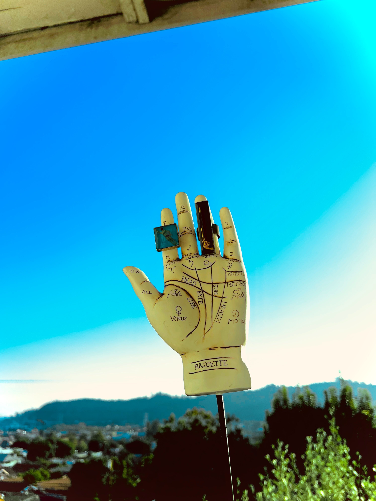

# Resources

<figure><figcaption></figcaption></figure>

### <mark style="background-color:green;">Articles</mark>

* [**NASA on Eclipses**](https://science.nasa.gov/eclipses/)
* [**Time & Date's table of future eclipses**](https://www.timeanddate.com/eclipse/)

### <mark style="background-color:red;">Books</mark>

* **Interpreting the Eclipses, by Robert Jansky**
