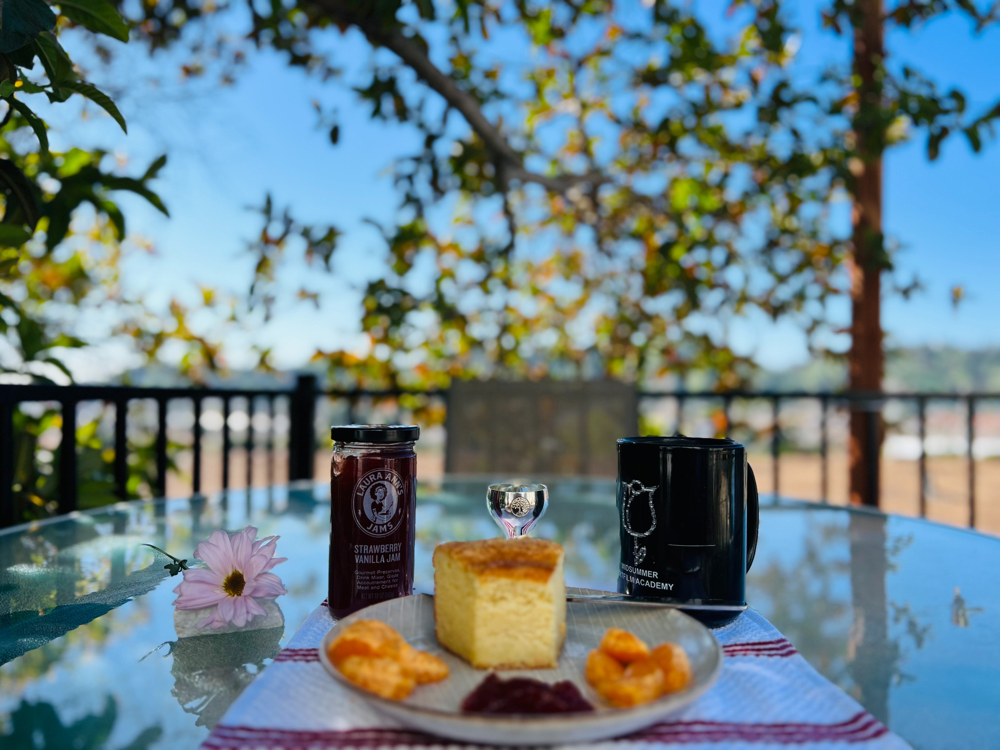

# Locus I: Identity

<figure><figcaption></figcaption></figure>

### <mark style="background-color:green;">The first locus theme is the player's mind and body, appearance, and personality.</mark>

### <mark style="background-color:green;">The first locus is the filter the player wears to see reality, and how the player articulates who they are.</mark>

### <mark style="background-color:green;">For example, suppose the player's first locus has the constellation of Virgo. In this case, the player is not only playing for the Virgo team, but also reasoning each of the following 11th loci under the Virgo team's rationale (at least at the highest level, without considering the planets' influence).</mark>



***

## For Nations and Communities

* The country and its inhabitants as a whole; its general condition of prosperity and health or the reverse.

***

## With the Sun

* Increase of native's vitality.

## With Mercury

* Native will devote more thought to personal self-projection and goals.
* They will become more talkative and expressive.

## With Venus

* The native becomes socially outgoing and active in efforts to initiate social activities.

## With Mars&#x20;

* Mars is dignified in the first house.&#x20;
* Initiates a period of greater self-assertion and personal physical activity.
* It could also signify physical danger, accident, injury.

## With Jupiter

* A time when the native is able to develop a more positive self-image.
* While under this transit the native expresses greater optimism and self-confidence,

## With Saturn

* Increased reserve, while making one austere and serious in expression.
* Constructive self-discipline.
* Digestive problems can occur.

## With Uranus

* Radical change in self-awareness and personal outlook on life.
