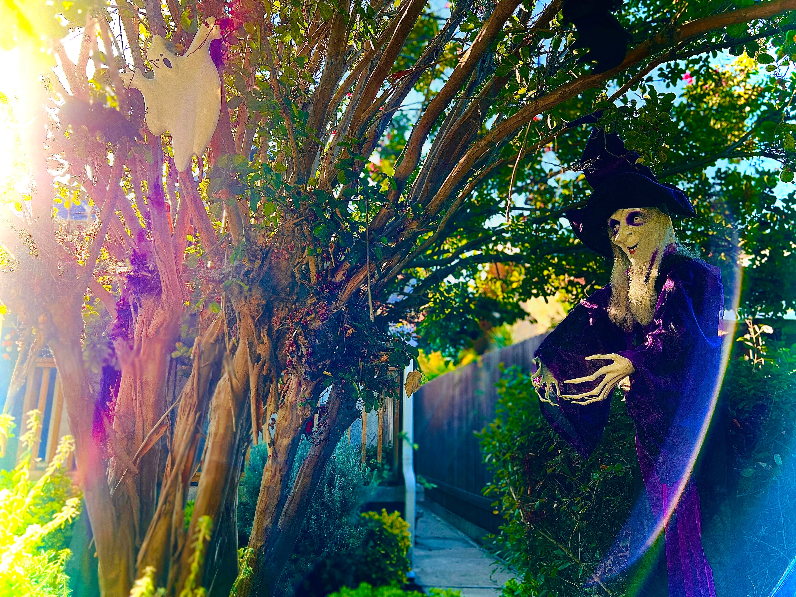

# Locus V: Pleasure

<figure><figcaption></figcaption></figure>

### <mark style="background-color:red;">The fifth locus theme is creativity, self-expression, the game of chances, and the joy the player shares with the world.</mark>

### <mark style="background-color:red;">This locus speaks of: leisure, fun, enjoyment, pleasure, gambling, games, romance, orgasm, children, fertility, and creative self-expression.</mark>

***

## For Nations and Communities

* Theatres, public houses, all places of amusement, entertainment, and pleasure. The birth-rate, children, sexual concerns. Sports, speculation, gambling. Some consider that it is connected with 'high society' and formal social functions. It has also been suggested that it relates to the House of Lords, the opposition of the 11th. Traditional astrologers included ambassadors under this house.

***

## With the Sun

* Period of creative self-expression and sexual stimulation.

## With Mercury

* Inclination to express greater interest in children and their education.
* Pleasure in the pursuit of intellectual studies, travel, stimulating lectures, reading materials, and games.
* Messages from romantic partners or children.
* Financial gain.

## With Venus

* An active and expanding social life with varied pleasurable pursuits.

## With Mars

* Aggressive pursuit of pleasure, romance, or creative self-expression
* Intensification of sex drive
* Natives are prone to act impulsively or rashly where investments are concurrent.
* Probability of injuries or accidents through sports or other forms of physical play
* Good periods to initiate the education of children

## With Jupiter

* Favorable period for romance, artistic expression, work with children, and financial speculations.

## With Saturn

* Increased responsibility related to children and creative projects.
* Not a good time for speculative financial investments.

## With Uranus

* Unusual and exciting romances and creative experiences.

