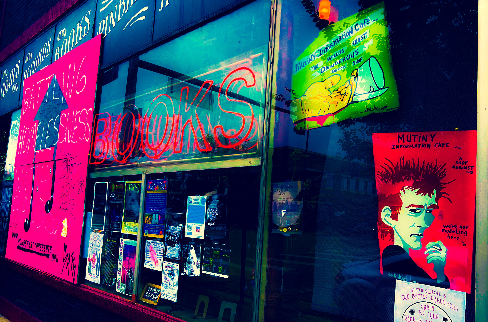

# Locus VI: Health

<figure><figcaption></figcaption></figure>

### <mark style="background-color:yellow;">The sixth locus theme determines how the player organizes routine, cares for their health, and attitudes toward service to others.</mark>

### <mark style="background-color:yellow;">This locus speaks of: routine, service, duties, co-workers, vitality, self-care, wellness, and pets.</mark>

***

## For Nations and Communities

* Public health or sickness. Epidemics. The health service. The national services: army, navy, and Civil Service as servants of the country. Workers and employees generally. Trade unions.

***

## With the Sun

* Period of increased self-expression in the native's work and habits.

## With Mercury

* Application of intelligence toward improving their work and health conditions.

## With Venus

* Improved habits and routine.

## With Mars

* Physical activity concerting work, service, health.
* Work can be disagreeable and conflict could arise due to high fevers or accidents.
* A well-aspected Mars gives the native the energy to be effective in his work.

## With Jupiter

* A time of increased opportunities with respect to work and employment.
* The native's work may become involved with publishing, teaching, religion, travel, or with educational or medical institutions.

## With Saturn

* Time of increased responsibility in one's work.&#x20;
* The native might manifest skill, efficiency, good organization, patience, in their work.

## With Uranus

* New and interesting experiences through work, employment, service, and health matters.
