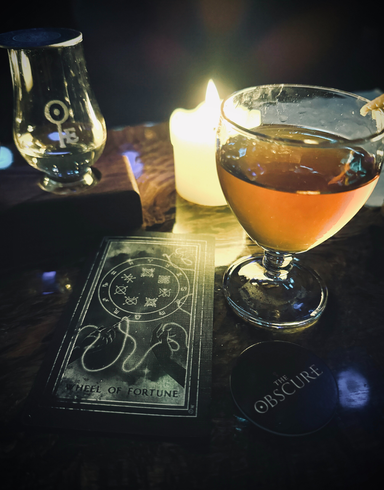

# ♂️ Mars

## <mark style="background-color:purple;">Astronomical data</mark>

<table><thead><tr><th width="374" align="center">Variable</th><th align="center">Data</th></tr></thead><tbody><tr><td align="center">Length of day</td><td align="center">24.6 hours</td></tr><tr><td align="center">Length of year</td><td align="center">687 Earth days</td></tr><tr><td align="center">Moons</td><td align="center">2</td></tr><tr><td align="center">Radius</td><td align="center">2,106 miles (3,390 kilometers)</td></tr><tr><td align="center">NASA info</td><td align="center"><a href="https://solarsystem.nasa.gov/planets/mars/in-depth/">Mars in depth</a></td></tr></tbody></table>

## <mark style="background-color:green;">Astrological data</mark>

<table><thead><tr><th width="227" align="center">Variable</th><th align="center">Data</th></tr></thead><tbody><tr><td align="center">Semi-stochastic influences</td><td align="center">Affects the player's passion, aggression, sex drive, action, desire, competition, courage.</td></tr><tr><td align="center">Time in each constellation</td><td align="center">6-7 Weeks</td></tr><tr><td align="center">Teams ruled</td><td align="center">Aries</td></tr></tbody></table>

<figure><figcaption></figcaption></figure>
