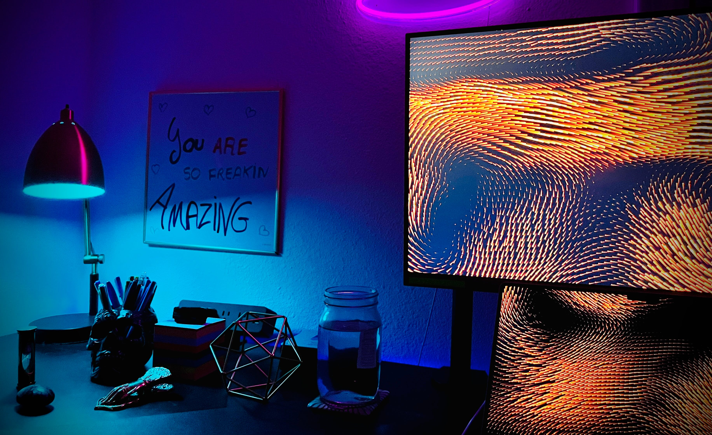

# ⚕️The T=0 snapshot

<figure><figcaption></figcaption></figure>

### <mark style="color:purple;">**The**</mark>**&#x20;**<mark style="color:orange;">**configuration of attributes of a player's avatar**</mark>**&#x20;**<mark style="color:purple;">**can be calculated with the exact**</mark>**&#x20;**<mark style="color:orange;">**spacetime coordinates**</mark>**&#x20;**<mark style="color:purple;">**the player**</mark>**&#x20;**<mark style="color:orange;">**came in the game.**</mark>

### <mark style="color:purple;">**(**</mark>_<mark style="color:purple;">**i.e.,**</mark>_<mark style="color:purple;">**&#x20;**</mark><mark style="color:purple;">**the geo-coordinates and the time the player started on Earth).**</mark>
