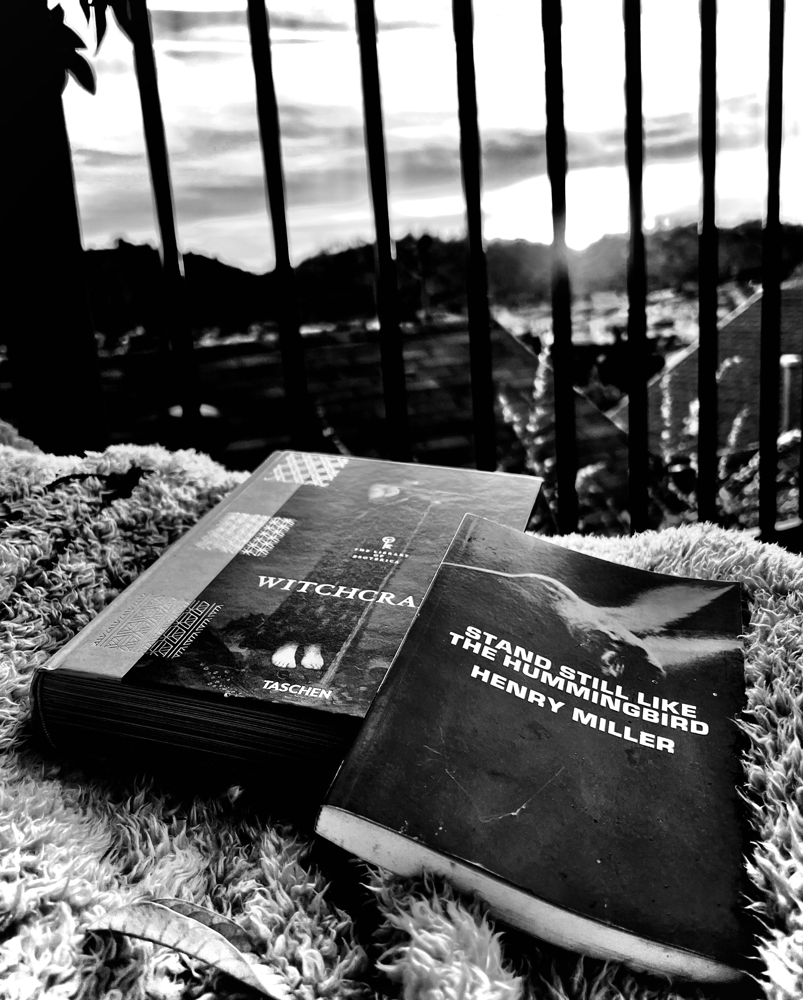

# ☾ Moon

## <mark style="background-color:purple;">Astronomical data</mark>

<table><thead><tr><th width="374" align="center">Variable</th><th align="center">Data</th></tr></thead><tbody><tr><td align="center">Length of day</td><td align="center">The Moon is rotating at the same rate that it revolves around the Earth (called synchronous rotation), so the same hemisphere faces the Earth all the time.</td></tr><tr><td align="center">Fun fact</td><td align="center">The Moon is slowly moving away from Earth, getting about an inch farther away each year.</td></tr><tr><td align="center">Radius</td><td align="center">1,080 miles (1,740 kilometers)</td></tr><tr><td align="center">NASA info</td><td align="center"><a href="https://solarsystem.nasa.gov/moons/earths-moon/overview/">Moon in depth</a></td></tr></tbody></table>

## <mark style="background-color:green;">Astrological data</mark>

<table><thead><tr><th width="227" align="center">Variable</th><th align="center">Data</th></tr></thead><tbody><tr><td align="center">Semi-stochastic influences</td><td align="center">Affects the player's internal identity, how they nurture and nourish themselves and their loved ones, the player's emotions, unconsciousness, instincts, habits, and moods.</td></tr><tr><td align="center">Time in each constellation</td><td align="center">2-3 Days</td></tr><tr><td align="center">Teams ruled</td><td align="center">Cancer</td></tr></tbody></table>

<figure><figcaption></figcaption></figure>
