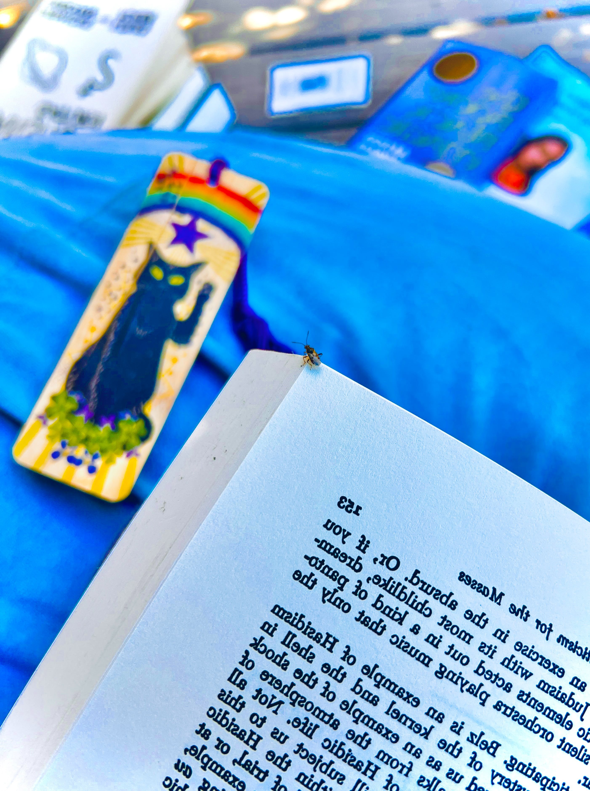

# Yin and Yang

<figure><figcaption></figcaption></figure>

### <mark style="color:orange;">**The Tao underlies the cosmos...**</mark>

### _<mark style="color:purple;">**Yang, the light, active, masculine principle**</mark>_

### _<mark style="color:green;">**Yin, the dark, passive, and feminine principle.**</mark>_

### <mark style="color:orange;">**Their interaction constitutes the whole world of forms.**</mark>



