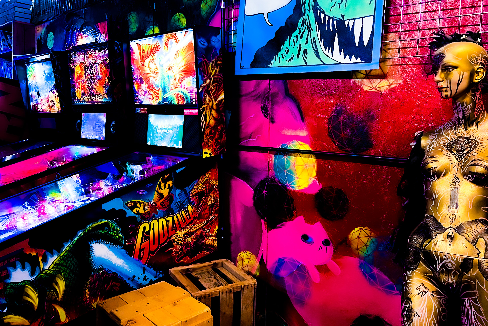

# Non-fungible tokens

<figure><figcaption></figcaption></figure>

### <mark style="color:purple;">In the</mark> <mark style="color:orange;">web2 model</mark><mark style="color:purple;">, when data is uploaded to a company's centralized platform, the ownership is transferred to the company. Web2 platforms monetize on the content and maintain most of the value. Purchasing a film from a web2 centralized platform does not grant ownership.</mark>&#x20;

### <mark style="color:orange;">NFTs or non-fungible tokens</mark> <mark style="color:purple;">are files that live on a blockchain and they are suitable for collectibles, rewards, and digital ownership. They can be designed to enable artists to monetize and own the value of their work, with royalties baked into the smart contract's logic.</mark>&#x20;

### <mark style="color:purple;">An</mark> <mark style="color:orange;">NFT can represent any kind of digital item</mark><mark style="color:purple;">, whether it's an image, a video, a document, or an IRL event. Rather than a content license, the content itself is purchased. NFTs authenticity and scarcity can be confirmed via blockchain technology.</mark>
