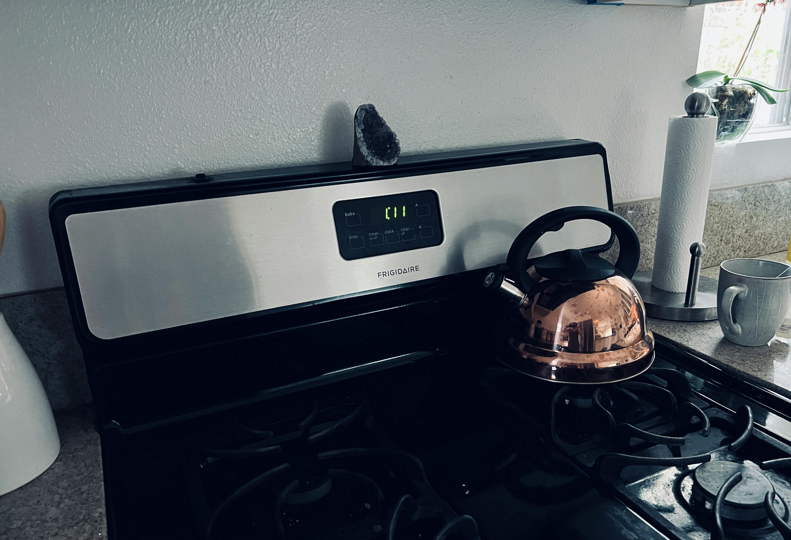

# DAOs

<figure><figcaption></figcaption></figure>

### <mark style="color:purple;">DAOs are essentially</mark>&#x20;

### <mark style="color:purple;">token-gated online communities.</mark>&#x20;

### <mark style="color:green;">DAOs enable many forms of</mark>&#x20;

### <mark style="color:green;">fundraising for projects,</mark>&#x20;

### <mark style="color:green;">community-led decision-making,</mark>&#x20;

### <mark style="color:green;">transparent capital flow,</mark>&#x20;

### <mark style="color:green;">and governance.</mark>
