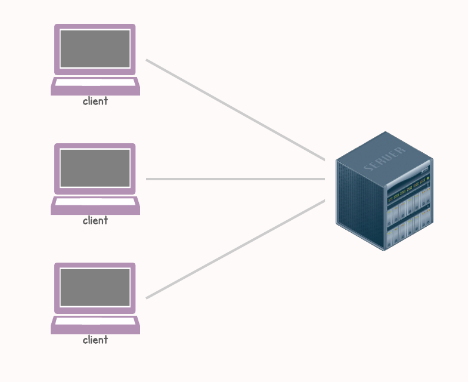

# Forbes

### <mark style="color:purple;">Billions of images, videos, songs, and status updates are uploaded to centralized platforms every day.</mark> <mark style="color:purple;"></mark><mark style="color:purple;">**In the traditional client-server architecture, servers are closed systems owned by a particular company**</mark><mark style="color:purple;">.</mark>

### <mark style="color:green;">The internet (i.e.,</mark> <mark style="color:green;"></mark>_<mark style="color:green;">the</mark>_ _<mark style="color:green;">cloud</mark>_<mark style="color:green;">) is a collection of these closed systems interacting. The traditional client-server model delivers great scalability and faster iteration, but it relies on a monopolistic behavior with centralized control and single points of failure.</mark>

<figure><figcaption></figcaption></figure>

### <mark style="color:green;">**Web3 architecture is decentralized by design**</mark><mark style="color:purple;">: blockchains are peer-to-peer networks.</mark> <mark style="color:purple;"></mark><mark style="color:purple;">**They trade technical scalability for social scalability.**</mark> <mark style="color:purple;"></mark><mark style="color:purple;">In this new paradigm,</mark> <mark style="color:green;">validators are incentivized to keep the network impartial.</mark> <mark style="color:purple;">There is no single point of failure, and each client node owns its data.</mark>

<figure><figcaption></figcaption></figure>
