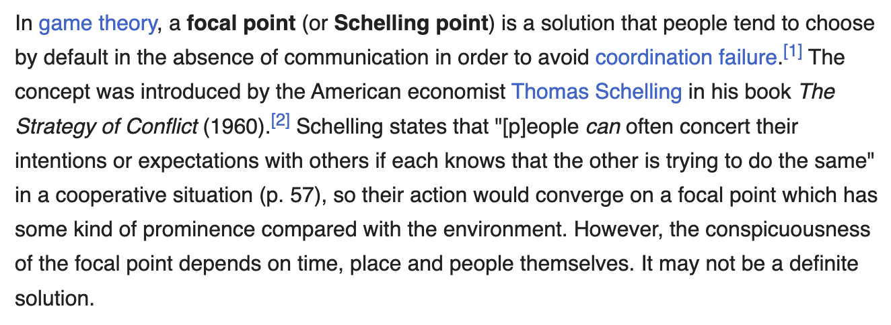

# 🕹️ 𝙶𝚊𝚖𝚎 𝚃𝚑𝚎𝚘𝚛𝚢

<figure><figcaption></figcaption></figure>

<figure><figcaption>
<a href="https://en.wikipedia.org/wiki/Focal_point_(game_theory)">https://en.wikipedia.org/wiki/Focal_point_(game_theory)</a>
</figcaption></figure>
