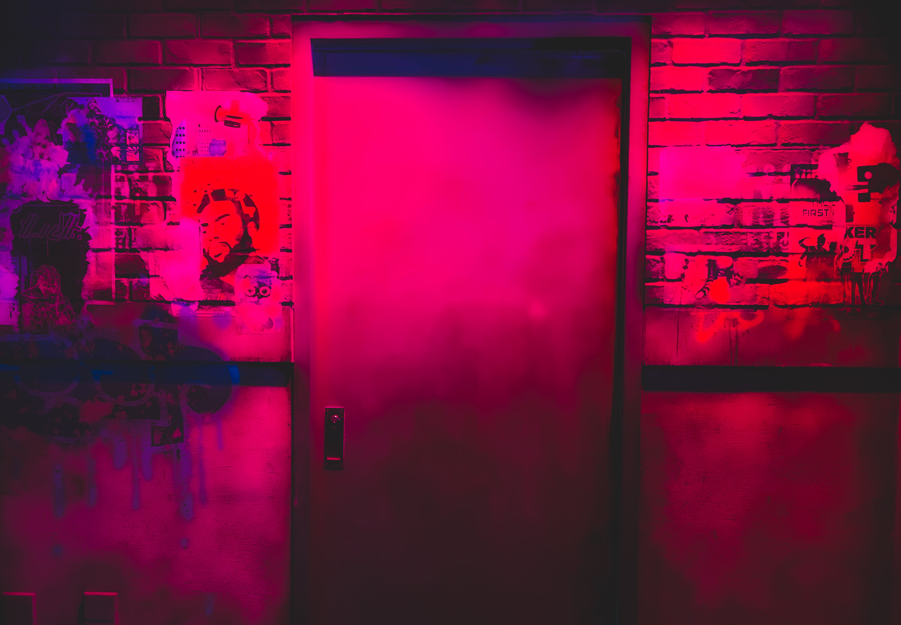

---
layout:
  title:
    visible: true
  description:
    visible: true
  tableOfContents:
    visible: true
  outline:
    visible: false
  pagination:
    visible: true
---

# 🔫 How do you make Evil real?

<figure><figcaption></figcaption></figure>

## <mark style="color:purple;">Through fear.</mark>&#x20;

## <mark style="color:purple;">You lose everything if you don't separate fear from reality.</mark>

## <mark style="color:red;">(instead, we will kill all predatory evil)</mark>


