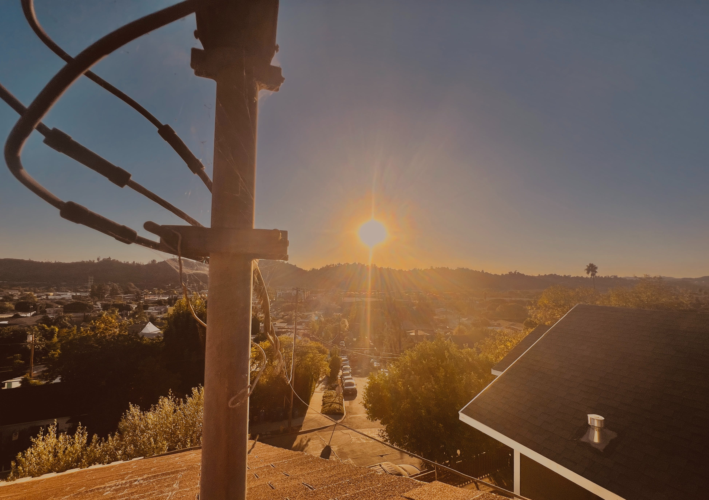

# 𝙸𝚜 𝙵𝚛𝚎𝚎 𝚆𝚒𝚕𝚕 𝚁𝚎𝚊𝚕 - II of V

<figure><figcaption></figcaption></figure>

## <mark style="color:yellow;">No. Free will is not real.</mark>&#x20;

### <mark style="color:blue;">The main route is already calculated; there is only some buffer to accommodate destiny over →∞ time. You are just a tiny beautiful perfect piece in the puzzle.</mark>

### <mark style="color:blue;">But you must believe free will is true to play your best game of $CHOICES.</mark>&#x20;

### <mark style="color:blue;">Believing in free will is the most uncomplicated way to comprehend how to rely on your intuition (which is your subconscious intellect telling you the most accurate answers for your most efficient route).</mark>

### <mark style="color:blue;">After many lessons (turns of the wheel), the goal is "understand". It's also your $CHOICE to find a way to relish your journey.</mark>&#x20;

### <mark style="color:blue;">(it's supposed to be enjoyable most of the time if you distance yourself from the illusion of "failure" ).</mark>


