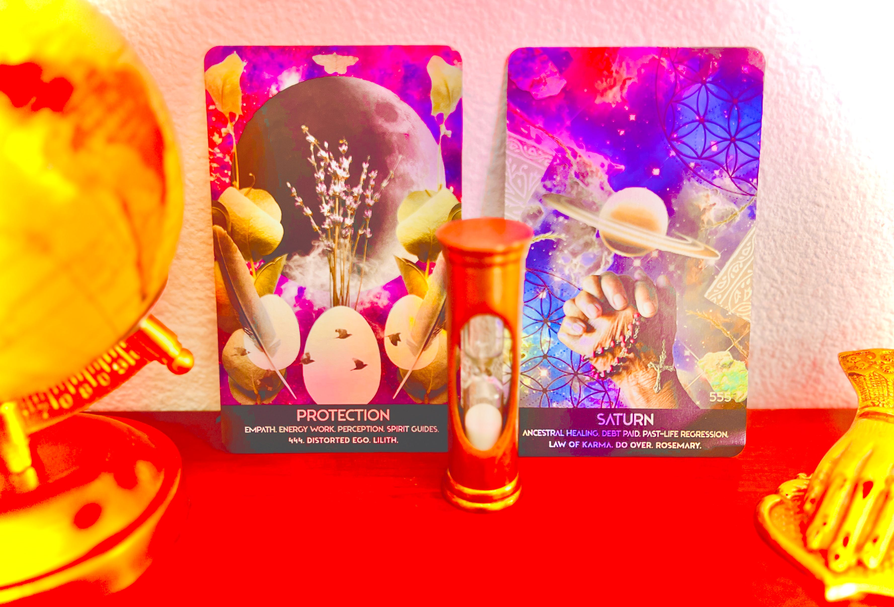

# ♄ The 10th nemesis < 1


_**Let my servants be few & secret: they shall rule the many & the known.**_


<figure><figcaption></figcaption></figure>

### <mark style="color:purple;">Once you reach enlightenment,</mark> [<mark style="color:purple;">astrology</mark>](https://www.ananda.org/ask-yogananda/is-astrology-spiritual/) <mark style="color:purple;">(or anything for that matter) does not affect your life anymore, as you slowly build your legacy.</mark>

### <mark style="color:purple;">You won everything and lost everything. The infinite is yours.</mark>

### &#x20;

## <mark style="color:green;">🏆</mark> <mark style="color:blue;">Attain כֶּתֶר‎.</mark>

## ✅ Tested.
