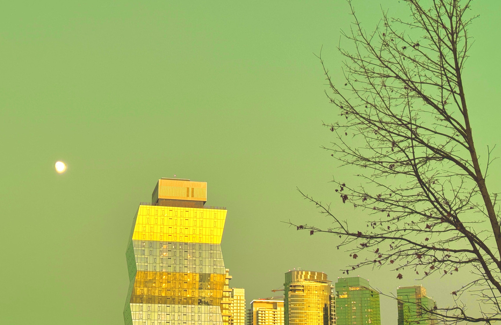

# ☽ The 2nd nemesis < 7


_**The unveiling of the company of Heaven.**_


<figure><figcaption></figcaption></figure>

### <mark style="color:purple;">Once you acknowledge that power, you will yearn more. You will want to become the most mighty magickian in the game (or something like that...).</mark>&#x20;

### <mark style="color:red;">The second enemy will appear when it's time for you to pay your dues. You actually have no choice on this one: you must let it be taken. If you try to keep both the fee and the reward, you will lose both.</mark>&#x20;

### <mark style="color:red;">This is serious. Be prepared to pay the price if you want to advance. Or you will be stuck in the loop (wheel) again.</mark>

### <mark style="color:red;">The goal is to trick your mind into not being wrecked when you let go of things you once cared about. It's all an illusion; reality is not what you think you know.</mark>

### <mark style="color:red;">If you trust the process, you will connect all the dots later and realize your hero's journey, and how it was the way it was supposed to be.</mark>

### <mark style="color:red;">If you fail, your existence gets dissolved (e.g., you might become an NPC).</mark>

### <mark style="color:green;">💡 You can ALWAYS find a new, unexpected source of complete bliss and gratitude. It's an infinite set; don't let your mind trick you.</mark>

## <mark style="color:green;">🏆</mark> <mark style="color:blue;">Attain יְסוֹד.</mark>

## ✅ Tested.
