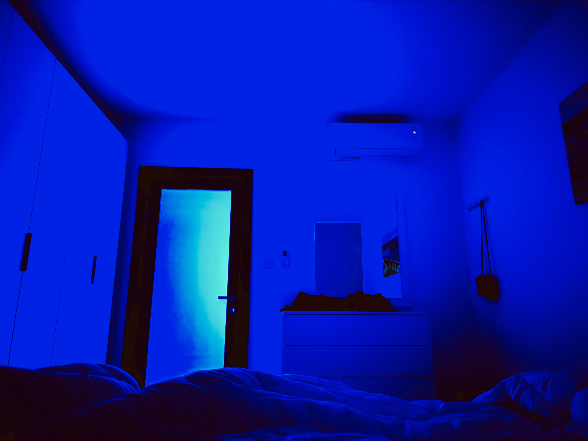

# ♇ The 5th nemesis < 8


_**Help me,  o warrior lord of Thebes, in my unveiling before the Children of humans!**_


<figure><figcaption></figcaption></figure>

### _<mark style="color:yellow;">Oh, κλῖμαξ</mark>_<mark style="color:yellow;">.</mark>

### <mark style="color:purple;">For a short amount of time, the fifth enemy will steal your light, your vital force, your magick. You will feel powerless for a while.</mark>

### <mark style="color:red;">The goal is to survive until it's over.</mark>&#x20;

### <mark style="color:red;">If you fail, you will forfeit everything you have achieved and be stuck in some of the previous wheels</mark>

### <mark style="color:green;">💡 You can't simply "go back" from 5.</mark>

### <mark style="color:green;">💡 The game's algorithm will issue you helpers (what they called "angels" or "miracles" back in the day); humbly accept the help while waiting for your luck to return.</mark>

### <mark style="color:green;">💡 Advanced players only: if you can tame 5 energy, you can summon the</mark> [strongest](https://www.reuters.com/news/picture/rare-snow-in-los-angeles-blankets-peaks-idUSRTSGOKNV/) [magick](https://www.theguardian.com/world/2023/aug/20/hurricane-hilary-approaches-california-mexico-climate-crisis) <mark style="color:green;">yet.</mark>

## <mark style="color:green;">🏆</mark> <mark style="color:blue;">Attain גְּבו.</mark>

## ✅ Tested.
