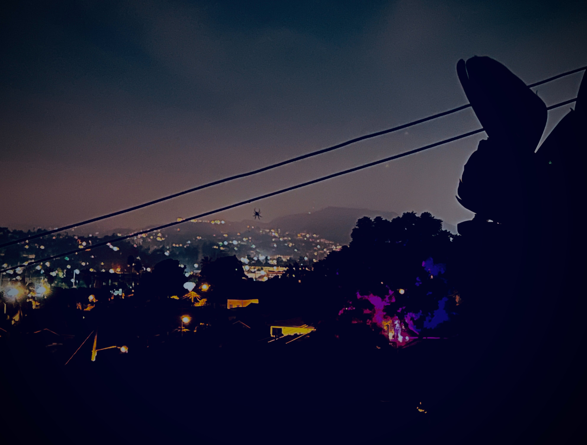

# ♀️ The 4th nemesis < 5


_**Every number is infinite; there is no difference.**_


<figure><figcaption></figcaption></figure>

### <mark style="color:purple;">The fourth enemy will cause you to be inebriated on amusement.</mark>

### <mark style="color:red;">The goal is to recompose yourself after the delirious feeling (before, for instance, starting to take things for granted).</mark>

### <mark style="color:red;">If you fail, you may pause your own game, and be stuck in the wheel.</mark>

### <mark style="color:green;">💡 You can stay there for a while and have a cool story or fun memories, but leave when you are too drunk to remember who you are.</mark>&#x20;

### <mark style="color:green;">💡 Venus as an "enemy" is more prominent when retrograde.</mark>&#x20;

## <mark style="color:green;">🏆</mark> <mark style="color:blue;">Attain נֶצַח.</mark>

## ✅ Tested.
