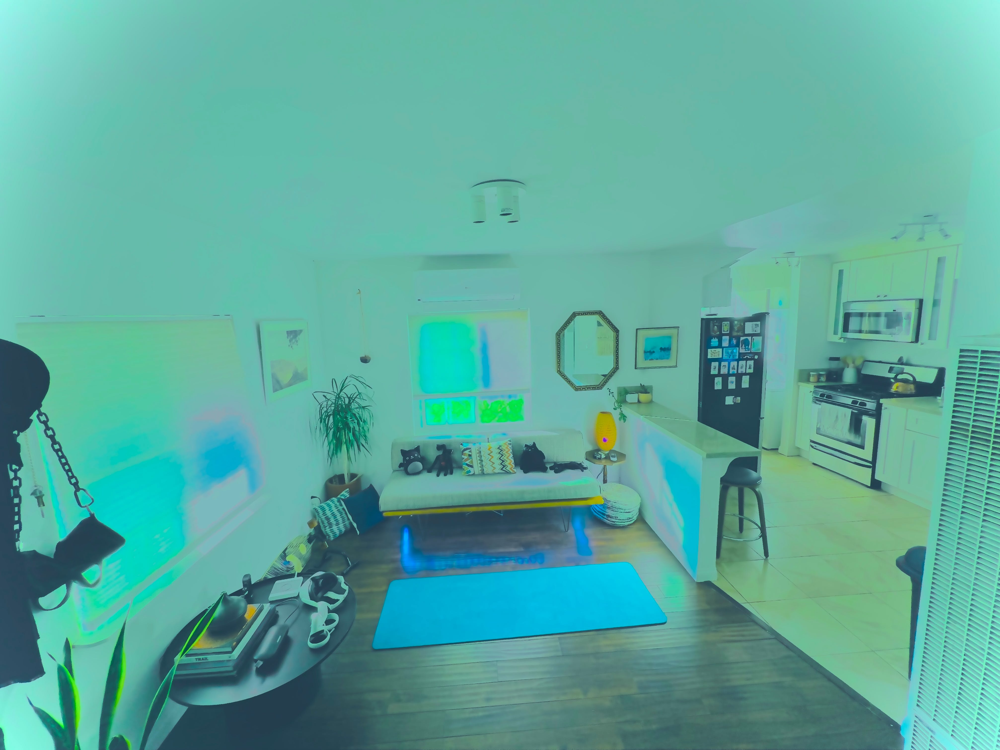

# 👾 𝚃𝚑𝚎 𝚀𝚞𝚊𝚗𝚝𝚞𝚖 𝚂𝚒𝚖𝚞𝚕𝚊𝚝𝚒𝚘𝚗

<figure><figcaption></figcaption></figure>

### <mark style="color:red;">You are the main protagonist</mark> <mark style="color:red;">of your story, playing for one of the</mark> [12 teams](the-character-and-the-team-you-play/)<mark style="color:red;">, with some</mark> [influences](../../astrology/the-usdchoice-of-astrology/the-hubble-chart-thc/birth-chart/) <mark style="color:red;">from the other teams.</mark>&#x20;

### <mark style="color:orange;">The</mark> [12 loci ](../../astrology/the-usdchoice-of-astrology/houses/)<mark style="color:orange;">set circular quests.</mark> [Planets](../../astrology/the-usdchoice-of-astrology/planets/) <mark style="color:orange;">are engines creating semi-</mark>[stochastic](../../computers/the-usdchoice-of-computers/simulations-and-determinism/) <mark style="color:orange;">influences (according to the</mark> [energy](../../alchemy/the-usdchoice-of-alchemy/energy/energy-in-alchemy.md) <mark style="color:orange;">from the constellation they are crossing through).</mark>&#x20;

### <mark style="color:blue;">In the middle of all this, all the players are fighting for their free will, aka $CHOICES.</mark>

### <mark style="color:yellow;">**It's a kinda fun setup.**</mark>
