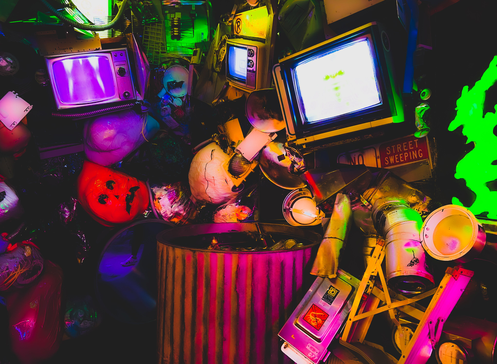

---
layout:
  title:
    visible: true
  description:
    visible: true
  tableOfContents:
    visible: true
  outline:
    visible: false
  pagination:
    visible: true
---

# 🦹‍♀️ 𝙸𝚗𝚝𝚎𝚛𝚊𝚌𝚝𝚒𝚟𝚎 𝙲𝚒𝚗𝚎𝚖𝚊

<figure><figcaption></figcaption></figure>

### <mark style="color:green;">Interactive cinema</mark> <mark style="color:purple;">gives an audience an active role.</mark>

### <mark style="color:purple;">A</mark> <mark style="color:green;">hybrid between participation and viewing</mark><mark style="color:purple;">, giving the player a strong amount of</mark> <mark style="color:green;">control</mark> <mark style="color:purple;">in the</mark> <mark style="color:green;">characters' decisions</mark><mark style="color:purple;">.</mark>


