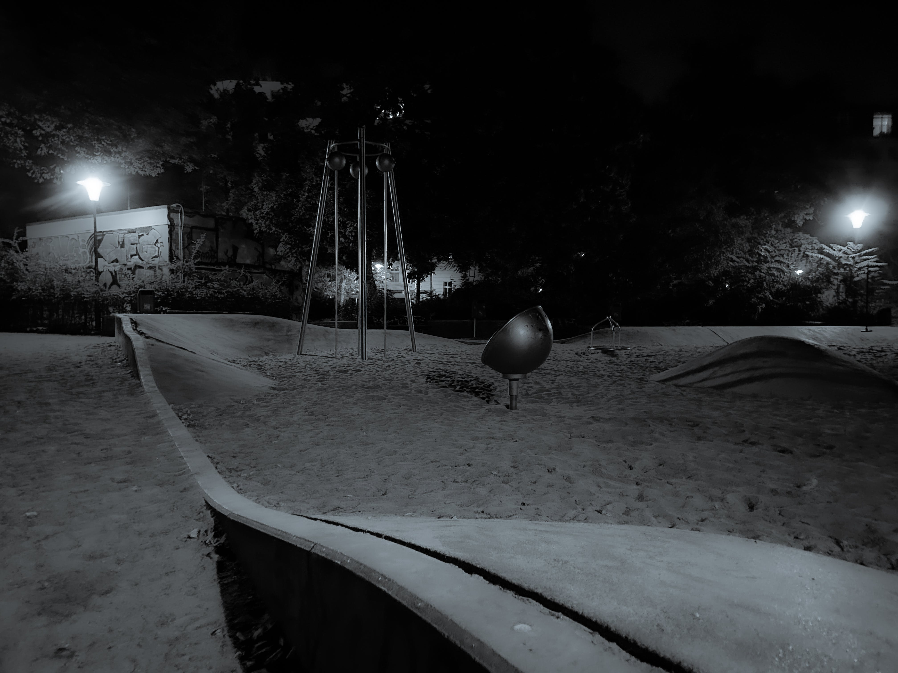

# 𝟺. 𝙷𝚘𝚖𝚎 𝚒𝚜 𝚠𝚑𝚎𝚛𝚎 𝚢𝚘𝚞 𝚋𝚊𝚔𝚎 𝚋𝚛𝚎𝚊𝚍.

<figure><figcaption></figcaption></figure>

### <mark style="color:purple;">**“Knowing yourself is the beginning of all wisdom.”**</mark>&#x20;

<mark style="color:purple;">**― Aristotle**</mark>
