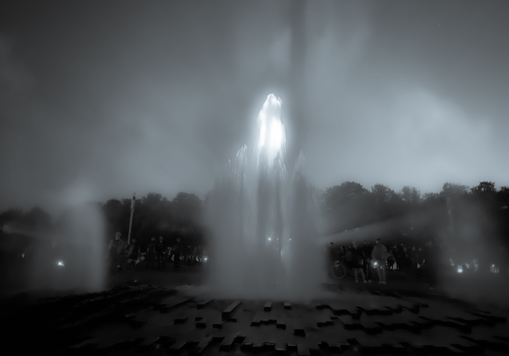

# 𝟻. 𝙿𝚕𝚊𝚢 𝚠𝚒𝚝𝚑 𝚢𝚘𝚞𝚛𝚜𝚎𝚕𝚏.

<figure><figcaption></figcaption></figure>

### <mark style="color:purple;">**“The lion cannot defend himself against snares and the fox cannot defend himself against wolves. Therefore, it is necessary to be a fox to discover the snares and a lion to terrify the wolves.”**</mark>&#x20;

<mark style="color:purple;">**- Niccolò Machiavelli**</mark>
