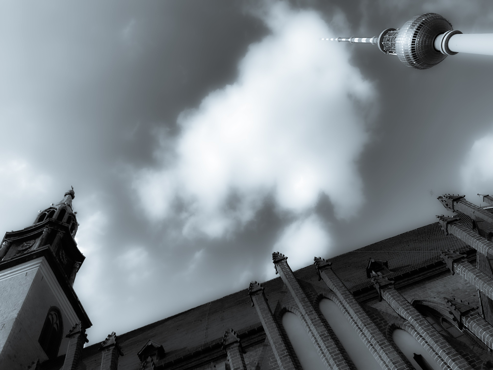

# 𝟼. 𝙼𝚊𝚜𝚝𝚎𝚛 𝚢𝚘𝚞𝚛 𝚌𝚛𝚊𝚏𝚝.

<figure><figcaption></figcaption></figure>

### <mark style="color:purple;">**"When you arise in the morning, think of what a precious privilege it is to be alive – to breathe, to think, to enjoy, to love."**</mark>

<mark style="color:purple;">**- Marcus Aurelius**</mark>
