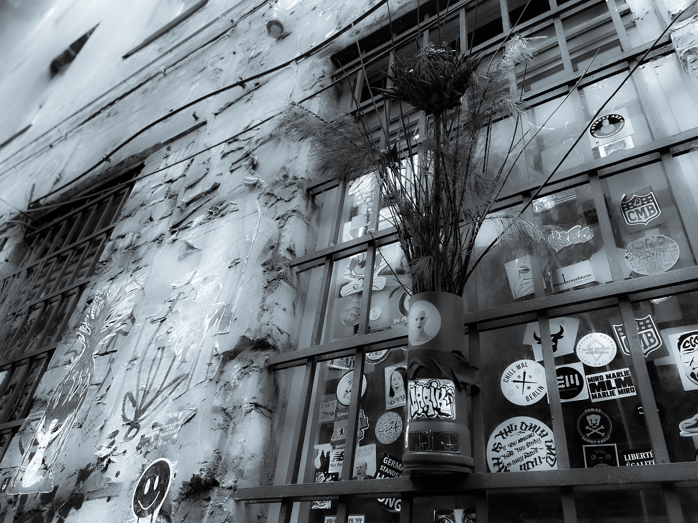

# 𝟿. 𝚂𝚕𝚒𝚍𝚎 𝚒𝚗𝚝𝚘 𝚐𝚘𝚍'𝚜 𝚍𝚖𝚜.

<figure><figcaption></figcaption></figure>

### <mark style="color:purple;">**"I talk about the gods, I am an atheist. But I am an artist too, and therefore a liar. Distrust everything I say. I am telling the truth."**</mark>&#x20;

#### <mark style="color:purple;">**- Ursula K. Le Guin**</mark>
