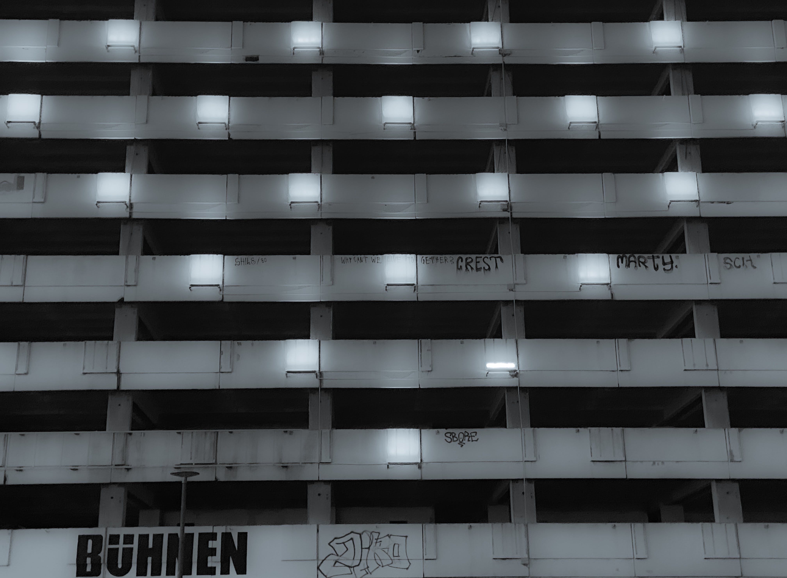

# 𝟷. 𝚃𝚑𝚎 𝚛𝚞𝚕𝚎𝚜 𝚘𝚏 𝚝𝚑𝚎 𝚐𝚊𝚖𝚎.

<figure><figcaption></figcaption></figure>

### <mark style="color:purple;">"What is life but an unpleasant interruption to a peaceful nonexistence".</mark>

<mark style="color:purple;">**- Jean-Paul Sartre**</mark>
