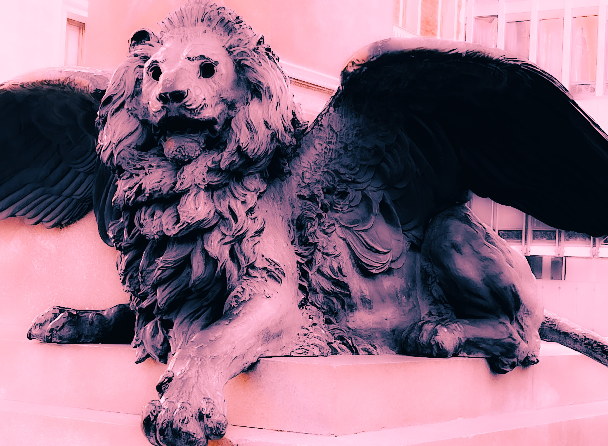

# 𝟻. 𝙸 𝚗𝚎𝚎𝚍 𝚜𝚙𝚊𝚌𝚎.

<figure><figcaption></figcaption></figure>

### <mark style="color:purple;">"The work's point of departure is the unity of reality divided into symmetrical and corresponding degrees, planes or worlds. A reality stretched between two poles: the original One (God, the source of all existence), and human (the microcosm, who, with their science brings the dispersion back to its origin, identifying and using their correspondences)."</mark>&#x20;

#### <mark style="color:purple;">―Eugenio Garin</mark>
