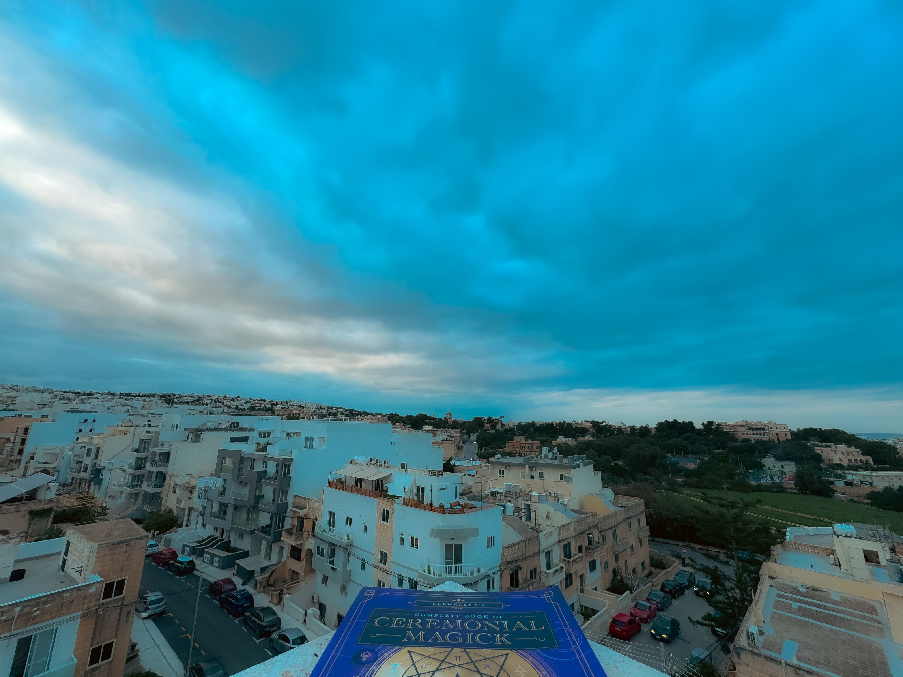

# 💚 𝚃𝚊𝚛𝚘𝚝 𝚆𝚒𝚝𝚑𝚘𝚞𝚝 𝙲𝚊𝚛𝚍𝚜

<figure><figcaption></figcaption></figure>

### <mark style="color:purple;">Players who master Tarot will have (knowingly or unknowingly)</mark>&#x20;

### <mark style="color:purple;">mastered the first superpower in alchemy:</mark>&#x20;

### <mark style="color:purple;">clairvoyance.</mark>

### <mark style="color:green;">Players self-graduate when they realize that the cards feel,</mark>&#x20;

### <mark style="color:green;">at this point, like a</mark> <mark style="color:green;"></mark>_<mark style="color:green;">supportive pillow.</mark>_
