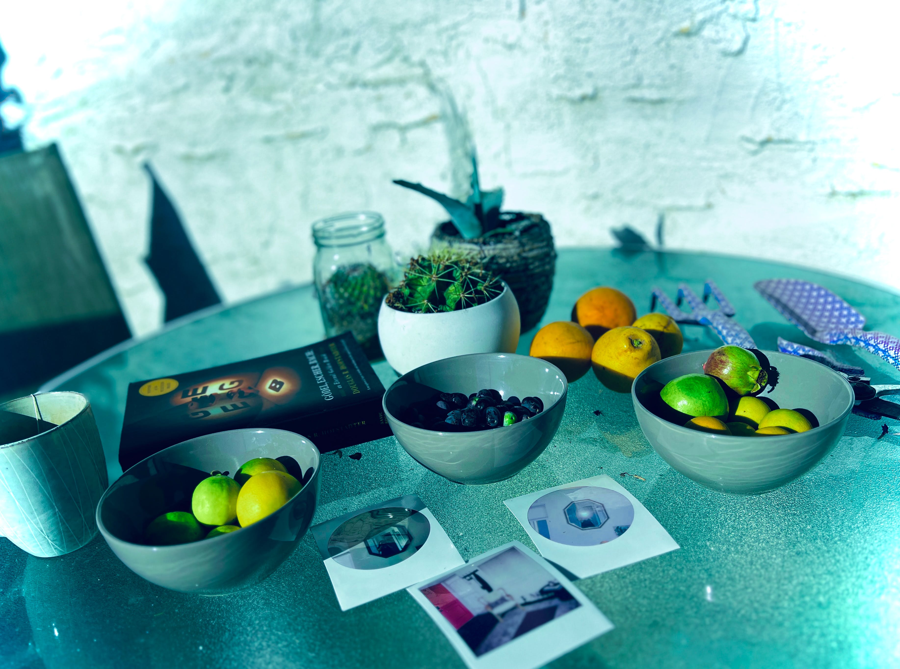

---
layout:
  title:
    visible: true
  description:
    visible: true
  tableOfContents:
    visible: true
  outline:
    visible: false
  pagination:
    visible: true
---

# Being honest to yourself

<figure><figcaption></figcaption></figure>

### <mark style="color:red;">✨⁉️</mark>&#x20;

### <mark style="color:red;">This page is being generated by the game.</mark>&#x20;

### <mark style="color:red;">Come back later.</mark>

### <mark style="color:red;">✨⁉️</mark>
