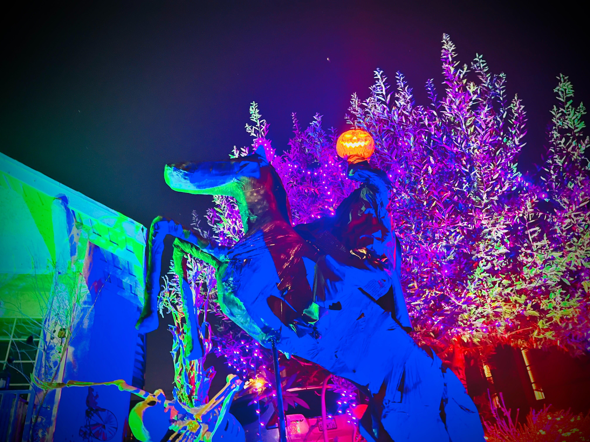

# The "Hero's journey" spread

<figure><figcaption></figcaption></figure>

### <mark style="color:green;">Select 12 cards and arrange them as a circle.</mark>&#x20;

### <mark style="color:green;">Read each card for its theme,  counterclockwise</mark>

## <mark style="color:red;">Card I: the player's self</mark>&#x20;

### [locus I theme: ](../../../../astrology/the-usdchoice-of-astrology/houses/locus-i-identity.md)

### <mark style="color:purple;">appearance, attitude, inner motivation, point of view</mark>

###

## <mark style="color:red;">Card II: the player's possession</mark>

### [locus II theme:](the-heros-journey-spread.md#locus-ii-theme)

### <mark style="color:purple;">values, self-worth, incoming</mark>

## <mark style="color:red;">Card III: the player's communication</mark>&#x20;

### [locus III theme:](the-heros-journey-spread.md#locus-iii-theme)

### <mark style="color:purple;">publishing, short trips, siblings</mark>

## <mark style="color:red;">Card IV: the player's home</mark>

### [locus IV theme: ](the-heros-journey-spread.md#locus-iv-theme)

### <mark style="color:purple;">properties, roots, parents</mark>

## <mark style="color:red;">Card V: the player's pleasures</mark>&#x20;

### [locus V theme: ](the-heros-journey-spread.md#locus-fifth-theme)

### <mark style="color:purple;">romance, creative projects, children</mark>

## <mark style="color:red;">Card VI: the player's health</mark>

### [locus VI theme: ](the-heros-journey-spread.md#locus-sixth-theme)

### <mark style="color:purple;">physical health, daily routine, pets</mark>

## <mark style="color:red;">Card VII: the player's partner</mark>&#x20;

### [locus VII theme: ](the-heros-journey-spread.md#locus-seventh-theme)

### <mark style="color:purple;">primary romantic or business partnerships, contracts</mark>

## <mark style="color:red;">Card VIII: the player's debts</mark>&#x20;

### [locus VIII theme: ](the-heros-journey-spread.md#locus-eight-theme)

### <mark style="color:purple;">shared resources, debts, transformation, sex</mark>

## <mark style="color:red;">Card IX: the player's mind expansion</mark>&#x20;

### [locus IX theme: ](the-heros-journey-spread.md#locus-ninth-theme)

### <mark style="color:purple;">higher learning, traveling abroad</mark>

## <mark style="color:red;">Card X: the player's career</mark>&#x20;

### [locus X theme: ](the-heros-journey-spread.md#locus-tenth-theme)

### <mark style="color:purple;">job, legacy, bosses, authorities</mark>

## <mark style="color:red;">Card XI: the player's community and higher purpose</mark>&#x20;

### [locus XI theme: ](the-heros-journey-spread.md#locus-eleventh-theme)

### <mark style="color:purple;">networking, materializing, grand ideas</mark>

## <mark style="color:red;">Card XII: the player's inner search</mark>&#x20;

### [locus XII theme:](../../../../astrology/the-usdchoice-of-astrology/houses/locus-xii-undoing/)

### <mark style="color:purple;">dreams, exile, transcendence, undoing</mark>

