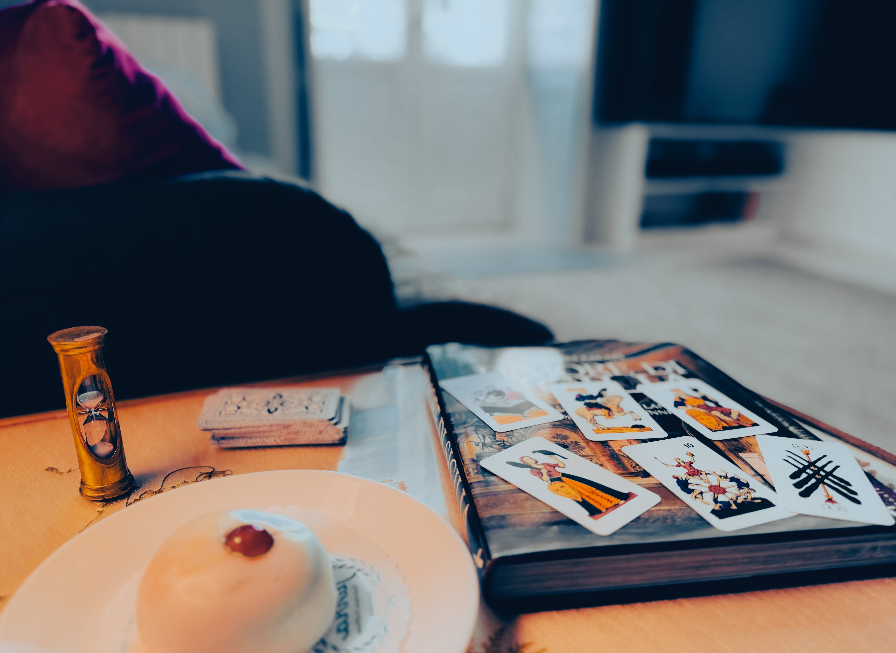

# Tarocchi Sicilliani

<figure><figcaption></figcaption></figure>

### <mark style="color:purple;">The Sicilian Tarot is probably the oldest of the Italian decks. It is thought to have originated from North Africa, brought by the Arabs during Swabia's domination (13th Century).</mark>

<figure><figcaption></figcaption></figure>

### <mark style="color:purple;">This deck is very different from the common Tarot. The minor arcana consists of 42 cards, and the four suits range from 5 to 10, plus the Queen, Knight, and King. Only the Coins suit also features the Ace and 4.</mark>
