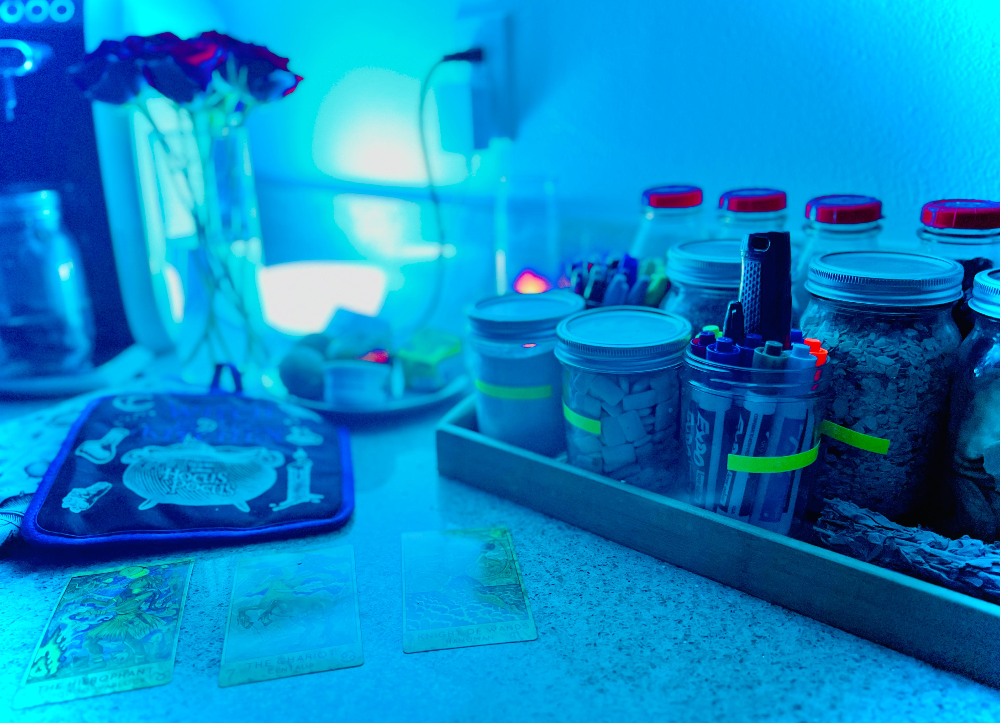

---
layout:
  title:
    visible: true
  description:
    visible: true
  tableOfContents:
    visible: true
  outline:
    visible: false
  pagination:
    visible: true
---

# A "gps" for players

<figure><figcaption></figcaption></figure>

### <mark style="color:purple;">A Tarot deck is a set of cards containing end-to-end narratives about central themes of the human condition (and the hero's journey). It originated in Europe in the early 15th century (and probably a variation from decks found in Mamluk, Egypt).</mark>

### <mark style="color:green;">Tarot is regarded as one of a player's most critical self-realization, self-discovery, inspiration, and guidance tool.</mark>
