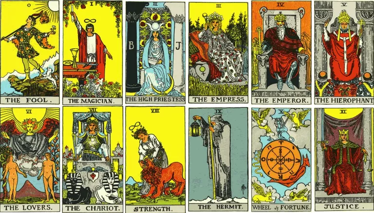

---
layout:
  title:
    visible: true
  description:
    visible: true
  tableOfContents:
    visible: true
  outline:
    visible: false
  pagination:
    visible: true
---

# The Rider–Waite tarot

### <mark style="color:purple;">The Rider–Waite tarot deck was originally published in 1909 and is the most popular deck these days.</mark>&#x20;

<figure><figcaption></figcaption></figure>

### <mark style="color:purple;">The deck has been published in numerous editions and inspired various variants and imitations.</mark>
